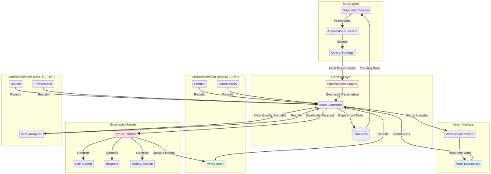
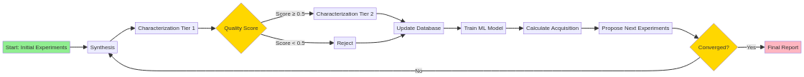
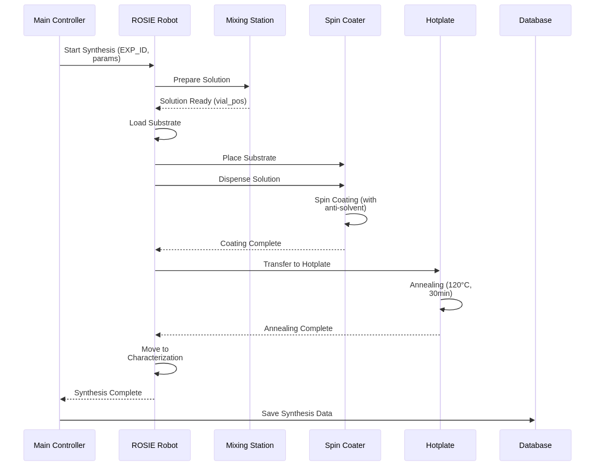
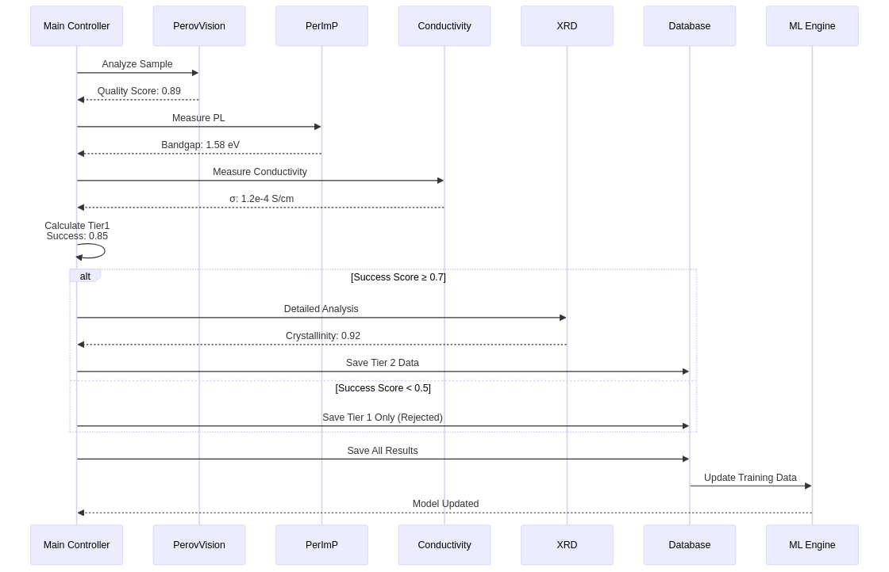
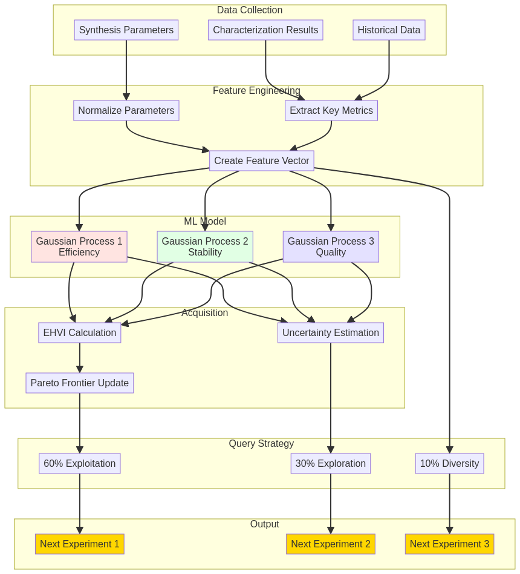
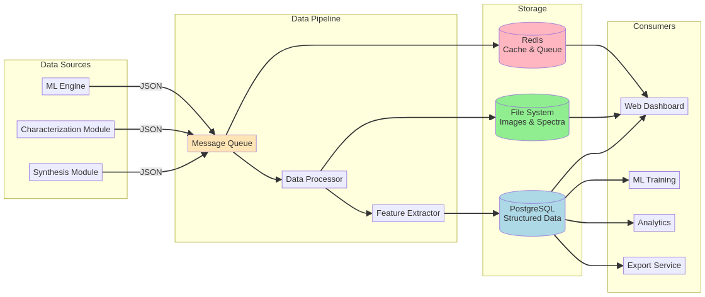
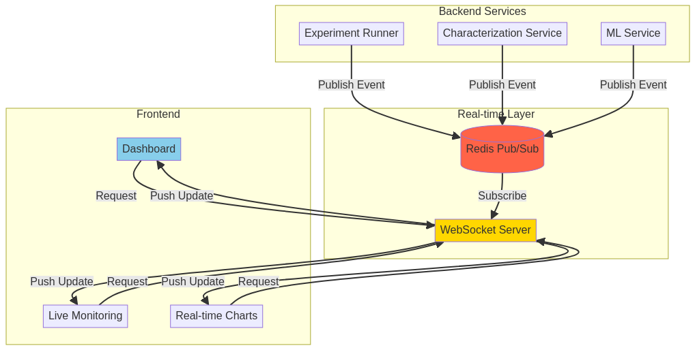
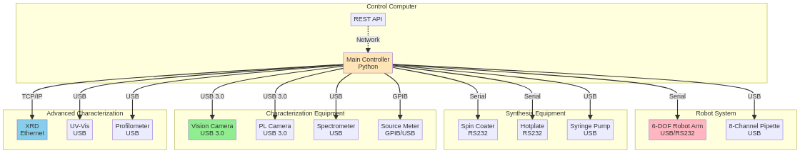

# Tier 1 Karakterizasyon Modülleri - Detaylı Teknik Dokümantasyon

## Genel Bakış

Tier 1 karakterizasyon sistemi, perovskite ince filmlerin ultra-hızlı (< 2 dakika/örnek) ve tahribatsız analizini sağlayan üç entegre modülden oluşur. Bu modüller, makine öğrenmesi destekli optimizasyon döngüsüne gerçek zamanlı veri akışı sağlar.

## 1. PerovVision: Bilgisayarlı Görü Modülü

### 1.1. Sistem Mimarisi

PerovVision, yüksek çözünürlüklü görüntü analizi ile perovskite filmlerin morfolojik ve optik özelliklerini piksel seviyesinde değerlendirir.

#### Donanım Bileşenleri

| Bileşen | Spesifikasyon | Amaç |
|---------|---------------|------|
| **Kamera** | Sony IMX477, 12.3 MP, 1/2.3" sensor | Yüksek çözünürlüklü görüntü yakalama |
| **Lens** | 16mm f/1.4, C-mount | Düşük distorsiyon, yüksek kontrast |
| **Aydınlatma** | LED ring light, 5500K, CRI>95 | Homojen, renk doğru aydınlatma |
| **Motorize Stage** | XY stage, 0.1 µm hassasiyet | Çoklu pozisyon taraması |
| **Enclosure** | Karanlık kutu, mat siyah iç yüzey | Dış ışık ve yansıma eliminasyonu |

#### Yazılım Pipeline

```python
# PerovVision İşleme Pipeline'ı

class PerovVision:
    def __init__(self):
        self.camera = Camera(resolution=(4056, 3040))
        self.preprocessor = ImagePreprocessor()
        self.segmentation_model = load_model('perovskite_segmentation.h5')
        self.feature_extractor = FeatureExtractor()
        
    def capture_image(self, sample_id):
        """
        Örnek görüntüsünü yakala
        """
        # Kamera ayarları
        self.camera.set_exposure(50)  # ms
        self.camera.set_gain(1.0)
        self.camera.set_white_balance('auto')
        
        # Çoklu pozisyon taraması (3x3 grid)
        images = []
        for x in range(3):
            for y in range(3):
                self.stage.move_to(x * 5, y * 5)  # 5mm aralık
                time.sleep(0.1)  # Stabilizasyon
                img = self.camera.capture()
                images.append(img)
        
        # Görüntüleri birleştir (stitching)
        full_image = self.stitch_images(images)
        return full_image
    
    def preprocess(self, image):
        """
        Görüntü ön işleme
        """
        # 1. Renk düzeltme
        image = self.preprocessor.color_correction(image)
        
        # 2. Gürültü azaltma (bilateral filter)
        image = cv2.bilateralFilter(image, d=5, sigmaColor=75, sigmaSpace=75)
        
        # 3. Kontrast normalizasyonu (CLAHE)
        lab = cv2.cvtColor(image, cv2.COLOR_RGB2LAB)
        l, a, b = cv2.split(lab)
        clahe = cv2.createCLAHE(clipLimit=2.0, tileGridSize=(8,8))
        l = clahe.apply(l)
        image = cv2.merge([l, a, b])
        image = cv2.cvtColor(image, cv2.COLOR_LAB2RGB)
        
        return image
    
    def segment_film(self, image):
        """
        Film bölgelerini segmente et
        """
        # U-Net tabanlı semantik segmentasyon
        mask = self.segmentation_model.predict(image)
        
        # Sınıflar:
        # 0: Background (substrat)
        # 1: Perovskite film
        # 2: Pinholes
        # 3: Cracks
        # 4: Aggregates
        
        return mask
    
    def extract_features(self, image, mask):
        """
        Kantitatif özellikler çıkar
        """
        features = {}
        
        # 1. Kaplama Oranı (Coverage)
        total_pixels = mask.shape[0] * mask.shape[1]
        film_pixels = np.sum(mask == 1)
        features['coverage'] = film_pixels / total_pixels
        
        # 2. Kusur Yoğunluğu (Defect Density)
        pinhole_pixels = np.sum(mask == 2)
        crack_pixels = np.sum(mask == 3)
        defect_area = (pinhole_pixels + crack_pixels) * (pixel_size ** 2)  # mm²
        features['defect_density'] = defect_area / film_area  # defects/cm²
        
        # 3. Homojenlik (Homogeneity)
        # RGB kanallarının standart sapması
        rgb_std = np.std(image[mask == 1], axis=0)
        features['homogeneity'] = 1 - (np.mean(rgb_std) / 255.0)
        
        # 4. Renk Özellikleri
        mean_rgb = np.mean(image[mask == 1], axis=0)
        features['mean_R'] = mean_rgb[0]
        features['mean_G'] = mean_rgb[1]
        features['mean_B'] = mean_rgb[2]
        
        # 5. Tekstür Özellikleri (GLCM)
        gray = cv2.cvtColor(image, cv2.COLOR_RGB2GRAY)
        glcm = graycomatrix(gray[mask == 1], [1], [0, np.pi/4, np.pi/2, 3*np.pi/4])
        features['contrast'] = graycoprops(glcm, 'contrast').mean()
        features['correlation'] = graycoprops(glcm, 'correlation').mean()
        features['energy'] = graycoprops(glcm, 'energy').mean()
        features['homogeneity_glcm'] = graycoprops(glcm, 'homogeneity').mean()
        
        # 6. Kristal Boyutu Tahmini (Fourier analizi)
        fft = np.fft.fft2(gray[mask == 1])
        fft_shift = np.fft.fftshift(fft)
        magnitude = np.abs(fft_shift)
        features['crystal_size_estimate'] = self.estimate_crystal_size(magnitude)
        
        return features
    
    def calculate_quality_score(self, features):
        """
        Genel kalite skoru hesapla (0-1 arası)
        """
        # Ağırlıklı skor
        Q = (
            0.3 * features['coverage'] +
            0.3 * features['homogeneity'] +
            0.2 * (1 - features['defect_density'] / 100) +  # normalize
            0.2 * features['correlation']
        )
        return np.clip(Q, 0, 1)
    
    def analyze(self, sample_id):
        """
        Tam analiz pipeline'ı
        """
        # 1. Görüntü yakalama
        image = self.capture_image(sample_id)
        
        # 2. Ön işleme
        processed = self.preprocess(image)
        
        # 3. Segmentasyon
        mask = self.segment_film(processed)
        
        # 4. Özellik çıkarımı
        features = self.extract_features(processed, mask)
        
        # 5. Kalite skoru
        quality_score = self.calculate_quality_score(features)
        
        # 6. Görselleştirme
        visualization = self.create_visualization(image, mask, features)
        
        # 7. Sonuçları kaydet
        results = {
            'sample_id': sample_id,
            'timestamp': datetime.now().isoformat(),
            'features': features,
            'quality_score': quality_score,
            'raw_image_path': f'data/images/{sample_id}_raw.png',
            'mask_path': f'data/images/{sample_id}_mask.png',
            'viz_path': f'data/images/{sample_id}_viz.png'
        }
        
        # Görüntüleri kaydet
        cv2.imwrite(results['raw_image_path'], image)
        cv2.imwrite(results['mask_path'], mask * 50)  # Görünürlük için ölçekle
        cv2.imwrite(results['viz_path'], visualization)
        
        return results
```

### 1.2. Performans Metrikleri

- **İşlem Süresi**: 45-60 saniye/örnek
  - Görüntü yakalama: 15 s
  - Ön işleme: 5 s
  - Segmentasyon: 20 s
  - Özellik çıkarımı: 10 s
  - Kaydetme: 5 s

- **Doğruluk**: 
  - Segmentasyon IoU: 0.92 ± 0.03
  - Kaplama oranı hatası: < 2%
  - Kusur tespiti F1-score: 0.88

### 1.3. Çıktı Formatı

```json
{
  "sample_id": "EXP_158",
  "timestamp": "2025-10-04T19:30:45",
  "features": {
    "coverage": 0.952,
    "defect_density": 12.3,
    "homogeneity": 0.876,
    "mean_R": 187.5,
    "mean_G": 142.3,
    "mean_B": 89.7,
    "contrast": 45.2,
    "correlation": 0.823,
    "energy": 0.156,
    "crystal_size_estimate": 245.0
  },
  "quality_score": 0.891,
  "raw_image_path": "data/images/EXP_158_raw.png",
  "mask_path": "data/images/EXP_158_mask.png",
  "viz_path": "data/images/EXP_158_viz.png"
}
```

---

## 2. PerImP: Perovskite Image Processing & Photoluminescence

### 2.1. Sistem Mimarisi

PerImP modülü, fotolüminesans görüntüleme ve spektroskopi ile perovskite filmlerin optoelektronik özelliklerini uzamsal çözünürlükle analiz eder.

#### Donanım Bileşenleri

| Bileşen | Spesifikasyon | Amaç |
|---------|---------------|------|
| **Excitation Source** | 405 nm LED, 100 mW | PL uyarımı |
| **Emission Filter** | 700-850 nm bandpass | PL emisyonu izolasyonu |
| **Spectrometer** | Ocean Optics USB4000, 200-1100 nm | Spektral analiz |
| **Imaging Camera** | FLIR Blackfly S, 2.3 MP, monochrome | PL görüntüleme |
| **Fiber Optic** | 400 µm core, UV-VIS | Nokta spektroskopi |
| **XY Stage** | Motorize, 1 µm hassasiyet | Uzamsal tarama |

#### Yazılım Pipeline

```python
class PerImP:
    def __init__(self):
        self.led = ExcitationLED(wavelength=405)
        self.camera = ImagingCamera()
        self.spectrometer = Spectrometer()
        self.stage = MotorizedStage()
        
    def capture_pl_image(self, sample_id, exposure_ms=100):
        """
        PL görüntüsü yakala
        """
        # LED'i aç
        self.led.set_power(50)  # mW
        time.sleep(0.5)  # Stabilizasyon
        
        # Kamera ayarları
        self.camera.set_exposure(exposure_ms)
        self.camera.set_gain(10)
        
        # Görüntü yakala
        pl_image = self.camera.capture()
        
        # LED'i kapat
        self.led.set_power(0)
        
        return pl_image
    
    def measure_pl_spectrum(self, sample_id, position=(0, 0)):
        """
        Belirli bir noktada PL spektrumu ölç
        """
        # Pozisyona git
        self.stage.move_to(*position)
        time.sleep(0.1)
        
        # LED'i aç
        self.led.set_power(50)
        time.sleep(0.5)
        
        # Spektrum ölç
        wavelengths, intensities = self.spectrometer.measure(
            integration_time=100,  # ms
            scans_to_average=5
        )
        
        # LED'i kapat
        self.led.set_power(0)
        
        return wavelengths, intensities
    
    def analyze_pl_image(self, pl_image):
        """
        PL görüntüsünden özellikler çıkar
        """
        features = {}
        
        # 1. Ortalama PL yoğunluğu
        features['mean_pl_intensity'] = np.mean(pl_image)
        
        # 2. PL homojenliği (CV - coefficient of variation)
        features['pl_homogeneity'] = 1 - (np.std(pl_image) / np.mean(pl_image))
        
        # 3. Parlak ve karanlık bölgeler
        threshold = np.percentile(pl_image, 50)
        bright_regions = pl_image > threshold
        features['bright_fraction'] = np.sum(bright_regions) / pl_image.size
        
        # 4. Uzamsal korelasyon
        autocorr = signal.correlate2d(pl_image, pl_image, mode='same')
        features['spatial_correlation'] = autocorr[pl_image.shape[0]//2, pl_image.shape[1]//2]
        
        return features
    
    def analyze_pl_spectrum(self, wavelengths, intensities):
        """
        PL spektrumundan özellikler çıkar
        """
        features = {}
        
        # 1. PL pik pozisyonu
        peak_idx = np.argmax(intensities)
        features['pl_peak_wavelength'] = wavelengths[peak_idx]
        features['pl_peak_intensity'] = intensities[peak_idx]
        
        # 2. Bant aralığı (bandgap) tahmini
        # E_g (eV) = 1240 / λ_peak (nm)
        features['bandgap_estimate'] = 1240 / features['pl_peak_wavelength']
        
        # 3. FWHM (Full Width at Half Maximum)
        half_max = features['pl_peak_intensity'] / 2
        indices = np.where(intensities >= half_max)[0]
        if len(indices) > 1:
            fwhm_wavelength = wavelengths[indices[-1]] - wavelengths[indices[0]]
            features['pl_fwhm'] = fwhm_wavelength
        else:
            features['pl_fwhm'] = 0
        
        # 4. Spektral saflık (peak sharpness)
        features['spectral_purity'] = features['pl_peak_intensity'] / features['pl_fwhm'] if features['pl_fwhm'] > 0 else 0
        
        # 5. Kuyruk emisyonu (tail emission)
        tail_region = wavelengths > (features['pl_peak_wavelength'] + 50)
        if np.any(tail_region):
            features['tail_emission_ratio'] = np.mean(intensities[tail_region]) / features['pl_peak_intensity']
        else:
            features['tail_emission_ratio'] = 0
        
        return features
    
    def multi_point_scan(self, sample_id, grid_size=(5, 5)):
        """
        Çoklu nokta PL spektroskopi taraması
        """
        results = []
        
        x_positions = np.linspace(0, 20, grid_size[0])  # 20 mm tarama alanı
        y_positions = np.linspace(0, 20, grid_size[1])
        
        for x in x_positions:
            for y in y_positions:
                wavelengths, intensities = self.measure_pl_spectrum(sample_id, (x, y))
                features = self.analyze_pl_spectrum(wavelengths, intensities)
                features['position'] = (x, y)
                results.append(features)
        
        return results
    
    def analyze(self, sample_id):
        """
        Tam PerImP analizi
        """
        # 1. PL görüntüsü yakala
        pl_image = self.capture_pl_image(sample_id)
        
        # 2. Görüntü analizi
        image_features = self.analyze_pl_image(pl_image)
        
        # 3. Merkez nokta spektrumu
        wavelengths, intensities = self.measure_pl_spectrum(sample_id, (10, 10))
        spectrum_features = self.analyze_pl_spectrum(wavelengths, intensities)
        
        # 4. Çoklu nokta tarama (opsiyonel, zaman varsa)
        # multi_point_data = self.multi_point_scan(sample_id, grid_size=(3, 3))
        
        # 5. Sonuçları birleştir
        results = {
            'sample_id': sample_id,
            'timestamp': datetime.now().isoformat(),
            'image_features': image_features,
            'spectrum_features': spectrum_features,
            'pl_image_path': f'data/pl_images/{sample_id}_pl.png',
            'spectrum_path': f'data/spectra/{sample_id}_spectrum.csv'
        }
        
        # Verileri kaydet
        cv2.imwrite(results['pl_image_path'], pl_image)
        np.savetxt(results['spectrum_path'], 
                   np.column_stack([wavelengths, intensities]),
                   delimiter=',', header='wavelength,intensity')
        
        return results
```

### 2.2. Performans Metrikleri

- **İşlem Süresi**: 40-50 saniye/örnek
  - PL görüntü yakalama: 15 s
  - Spektrum ölçümü: 10 s
  - Analiz: 10 s
  - Kaydetme: 5 s

- **Spektral Çözünürlük**: 1.5 nm (FWHM)
- **Uzamsal Çözünürlük**: 50 µm (fiber optic spot size)
- **Dinamik Aralık**: 10^4

### 2.3. Çıktı Formatı

```json
{
  "sample_id": "EXP_158",
  "timestamp": "2025-10-04T19:32:15",
  "image_features": {
    "mean_pl_intensity": 45678.5,
    "pl_homogeneity": 0.823,
    "bright_fraction": 0.567,
    "spatial_correlation": 0.912
  },
  "spectrum_features": {
    "pl_peak_wavelength": 785.3,
    "pl_peak_intensity": 89456.2,
    "bandgap_estimate": 1.579,
    "pl_fwhm": 38.5,
    "spectral_purity": 2323.5,
    "tail_emission_ratio": 0.045
  },
  "pl_image_path": "data/pl_images/EXP_158_pl.png",
  "spectrum_path": "data/spectra/EXP_158_spectrum.csv"
}
```

---

## 3. Conductivity Module: 4-Nokta Prob Elektriksel Karakterizasyon

### 3.1. Sistem Mimarisi

Conductivity modülü, perovskite filmlerin elektriksel iletkenliğini ve yüzey direncini tahribatsız olarak ölçer.

#### Donanım Bileşenleri

| Bileşen | Spesifikasyon | Amaç |
|---------|---------------|------|
| **4-Point Probe Head** | Jandel RM3000, 1 mm prob aralığı | Yüzey direnci ölçümü |
| **Source Meter** | Keithley 2400, ±1 µA - 1 A | Akım kaynağı ve voltaj ölçümü |
| **Z-axis Stage** | Motorize, 10 µm hassasiyet | Prob konumlandırma |
| **Force Sensor** | Loadcell, 0-100 g | Prob temas kuvveti kontrolü |
| **Temperature Sensor** | PT100, ±0.1°C | Sıcaklık kompanzasyonu |

#### Yazılım Pipeline

```python
class ConductivityModule:
    def __init__(self):
        self.probe = FourPointProbe()
        self.source_meter = SourceMeter()
        self.z_stage = ZAxisStage()
        self.force_sensor = ForceSensor()
        self.temp_sensor = TemperatureSensor()
        
    def approach_sample(self, target_force=20):
        """
        Probu örneğe kontrollü yaklaştır
        """
        self.z_stage.set_speed(0.5)  # mm/s
        
        while True:
            current_force = self.force_sensor.read()
            
            if current_force >= target_force:
                break
            
            self.z_stage.move_relative(-0.01)  # 10 µm adım
            time.sleep(0.05)
        
        # Stabilizasyon
        time.sleep(0.5)
    
    def measure_resistance(self, current_range=(1e-6, 1e-3)):
        """
        4-nokta direnci ölç
        """
        measurements = []
        
        # Çoklu akım seviyelerinde ölç
        currents = np.logspace(np.log10(current_range[0]), 
                               np.log10(current_range[1]), 
                               num=10)
        
        for I in currents:
            # Pozitif akım
            self.source_meter.set_current(I)
            time.sleep(0.1)  # Stabilizasyon
            V_pos = self.source_meter.measure_voltage()
            
            # Negatif akım (offset eliminasyonu)
            self.source_meter.set_current(-I)
            time.sleep(0.1)
            V_neg = self.source_meter.measure_voltage()
            
            # Ortalama voltaj
            V_avg = (V_pos - V_neg) / 2
            
            # Direnç hesapla
            R = V_avg / I
            
            measurements.append({
                'current': I,
                'voltage': V_avg,
                'resistance': R
            })
        
        # Akımı kapat
        self.source_meter.set_current(0)
        
        return measurements
    
    def calculate_sheet_resistance(self, measurements, film_thickness=None):
        """
        Yüzey direnci hesapla
        """
        # Ortalama direnç
        resistances = [m['resistance'] for m in measurements]
        R_avg = np.mean(resistances)
        R_std = np.std(resistances)
        
        # Yüzey direnci (Ω/sq)
        # R_sheet = (π / ln(2)) * R_measured ≈ 4.532 * R_measured
        correction_factor = np.pi / np.log(2)
        R_sheet = correction_factor * R_avg
        
        results = {
            'resistance_avg': R_avg,
            'resistance_std': R_std,
            'sheet_resistance': R_sheet,
            'sheet_resistance_unit': 'Ohm/sq'
        }
        
        # Eğer film kalınlığı biliniyorsa, hacim iletkenliği hesapla
        if film_thickness is not None:
            # σ = 1 / (R_sheet * t)
            conductivity = 1 / (R_sheet * film_thickness * 1e-7)  # S/cm (t in nm)
            results['conductivity'] = conductivity
            results['conductivity_unit'] = 'S/cm'
            results['film_thickness'] = film_thickness
            results['film_thickness_unit'] = 'nm'
        
        return results
    
    def retract_probe(self):
        """
        Probu örnek yüzeyinden kaldır
        """
        self.z_stage.move_relative(5)  # 5 mm yukarı
        time.sleep(0.5)
    
    def analyze(self, sample_id, film_thickness=None):
        """
        Tam iletkenlik analizi
        """
        # Sıcaklık ölç
        temperature = self.temp_sensor.read()
        
        # 1. Probu örneğe yaklaştır
        self.approach_sample(target_force=20)  # gram
        
        # 2. Direnci ölç
        measurements = self.measure_resistance()
        
        # 3. Yüzey direnci hesapla
        electrical_properties = self.calculate_sheet_resistance(measurements, film_thickness)
        
        # 4. Probu kaldır
        self.retract_probe()
        
        # 5. Sonuçları kaydet
        results = {
            'sample_id': sample_id,
            'timestamp': datetime.now().isoformat(),
            'temperature': temperature,
            'measurements': measurements,
            'electrical_properties': electrical_properties,
            'data_path': f'data/conductivity/{sample_id}_iv.csv'
        }
        
        # I-V verisini kaydet
        iv_data = np.array([[m['current'], m['voltage'], m['resistance']] 
                            for m in measurements])
        np.savetxt(results['data_path'], iv_data, 
                   delimiter=',', 
                   header='current,voltage,resistance')
        
        return results
```

### 3.2. Performans Metrikleri

- **İşlem Süresi**: 30-40 saniye/örnek
  - Prob yaklaşma: 10 s
  - Ölçüm: 15 s
  - Geri çekilme: 5 s

- **Direnç Aralığı**: 1 Ω - 10 MΩ
- **Doğruluk**: ±2% (R < 1 kΩ), ±5% (R > 1 kΩ)
- **Tekrarlanabilirlik**: CV < 3%

### 3.3. Çıktı Formatı

```json
{
  "sample_id": "EXP_158",
  "timestamp": "2025-10-04T19:33:30",
  "temperature": 23.5,
  "measurements": [
    {"current": 1e-6, "voltage": 0.00234, "resistance": 2340},
    {"current": 1e-5, "voltage": 0.02341, "resistance": 2341},
    ...
  ],
  "electrical_properties": {
    "resistance_avg": 2340.5,
    "resistance_std": 12.3,
    "sheet_resistance": 10605.8,
    "sheet_resistance_unit": "Ohm/sq",
    "conductivity": 1.23e-4,
    "conductivity_unit": "S/cm",
    "film_thickness": 450,
    "film_thickness_unit": "nm"
  },
  "data_path": "data/conductivity/EXP_158_iv.csv"
}
```

---

## 4. Tier 1 Entegrasyon ve Veri Akışı

### 4.1. Sıralı Çalıştırma Protokolü

```python
class Tier1Characterization:
    def __init__(self):
        self.perovvision = PerovVision()
        self.perimp = PerImP()
        self.conductivity = ConductivityModule()
        self.database = Database()
        
    def run_full_characterization(self, sample_id, film_thickness=None):
        """
        Tier 1 tam karakterizasyon
        """
        print(f"[Tier 1] Starting characterization for {sample_id}")
        start_time = time.time()
        
        results = {
            'sample_id': sample_id,
            'tier': 1,
            'start_time': datetime.now().isoformat()
        }
        
        # 1. PerovVision (45-60 s)
        print("[1/3] Running PerovVision...")
        try:
            perovvision_results = self.perovvision.analyze(sample_id)
            results['perovvision'] = perovvision_results
            print(f"  ✓ Quality Score: {perovvision_results['quality_score']:.3f}")
        except Exception as e:
            print(f"  ✗ PerovVision failed: {e}")
            results['perovvision'] = None
        
        # 2. PerImP (40-50 s)
        print("[2/3] Running PerImP...")
        try:
            perimp_results = self.perimp.analyze(sample_id)
            results['perimp'] = perimp_results
            print(f"  ✓ Bandgap: {perimp_results['spectrum_features']['bandgap_estimate']:.3f} eV")
        except Exception as e:
            print(f"  ✗ PerImP failed: {e}")
            results['perimp'] = None
        
        # 3. Conductivity (30-40 s)
        print("[3/3] Running Conductivity...")
        try:
            conductivity_results = self.conductivity.analyze(sample_id, film_thickness)
            results['conductivity'] = conductivity_results
            if 'conductivity' in conductivity_results['electrical_properties']:
                print(f"  ✓ Conductivity: {conductivity_results['electrical_properties']['conductivity']:.2e} S/cm")
        except Exception as e:
            print(f"  ✗ Conductivity failed: {e}")
            results['conductivity'] = None
        
        # Toplam süre
        total_time = time.time() - start_time
        results['end_time'] = datetime.now().isoformat()
        results['total_time_seconds'] = total_time
        
        print(f"[Tier 1] Completed in {total_time:.1f} seconds")
        
        # Veritabanına kaydet
        self.database.save_tier1_results(results)
        
        return results
```

### 4.2. Tier 1 Özet Metrikleri

Her Tier 1 karakterizasyonundan sonra, aşağıdaki özet metrikleri hesaplanır ve ML optimizasyon motoruna gönderilir:

```python
def calculate_tier1_summary(tier1_results):
    """
    Tier 1 sonuçlarından özet metrikleri hesapla
    """
    summary = {}
    
    # PerovVision'dan
    if tier1_results['perovvision']:
        pv = tier1_results['perovvision']['features']
        summary['coverage'] = pv['coverage']
        summary['defect_density'] = pv['defect_density']
        summary['homogeneity'] = pv['homogeneity']
        summary['quality_score'] = tier1_results['perovvision']['quality_score']
    
    # PerImP'den
    if tier1_results['perimp']:
        pi = tier1_results['perimp']['spectrum_features']
        summary['bandgap'] = pi['bandgap_estimate']
        summary['pl_intensity'] = pi['pl_peak_intensity']
        summary['pl_fwhm'] = pi['pl_fwhm']
        summary['spectral_purity'] = pi['spectral_purity']
    
    # Conductivity'den
    if tier1_results['conductivity']:
        cond = tier1_results['conductivity']['electrical_properties']
        summary['sheet_resistance'] = cond['sheet_resistance']
        if 'conductivity' in cond:
            summary['conductivity'] = cond['conductivity']
    
    # Genel başarı skoru (0-1)
    summary['tier1_success_score'] = calculate_success_score(summary)
    
    return summary

def calculate_success_score(summary):
    """
    Tier 1 başarı skoru hesapla
    """
    score = 0.0
    count = 0
    
    # Kalite (PerovVision)
    if 'quality_score' in summary:
        score += summary['quality_score']
        count += 1
    
    # Optik (PerImP)
    if 'spectral_purity' in summary:
        # Normalize edilmiş spektral saflık (0-1)
        norm_purity = np.clip(summary['spectral_purity'] / 5000, 0, 1)
        score += norm_purity
        count += 1
    
    # Elektriksel (Conductivity)
    if 'conductivity' in summary:
        # İyi iletkenlik: 1e-5 - 1e-3 S/cm arası
        log_cond = np.log10(summary['conductivity'])
        norm_cond = np.clip((log_cond + 5) / 2, 0, 1)  # -5 to -3 → 0 to 1
        score += norm_cond
        count += 1
    
    return score / count if count > 0 else 0.0
```

---

## 5. Tier 2 ve Tier 3 Önizleme

### Tier 2: Detaylı Karakterizasyon (Seçilmiş Örnekler)

Tier 1'de başarı skoru > 0.7 olan örnekler için:

- **XRD (X-Ray Diffraction)**: Faz saflığı, kristal yapı, tercihli yönelim
- **UV-Vis Transmittans**: Optik bant aralığı (Tauc plot)
- **Profilometre**: Film kalınlığı ve yüzey pürüzlülüğü

**Süre**: 15-20 dakika/örnek

### Tier 3: Uzun Süreli Testler (En İyi Örnekler)

Tier 2'de en iyi performans gösteren örnekler için:

- **Hızlandırılmış Yaşlandırma**: 85°C, 85% RH, sürekli aydınlatma
- **J-V Karakterizasyonu**: Basit cihaz yapımı ve verimlilik ölçümü
- **EQE (External Quantum Efficiency)**: Spektral yanıt

**Süre**: > 24 saat

---

## 6. Veri Yapısı ve Veritabanı Şeması

```sql
-- Tier 1 Karakterizasyon Tablosu
CREATE TABLE tier1_characterization (
    id SERIAL PRIMARY KEY,
    sample_id VARCHAR(50) NOT NULL,
    experiment_id VARCHAR(50) NOT NULL,
    timestamp TIMESTAMP NOT NULL,
    
    -- PerovVision
    coverage FLOAT,
    defect_density FLOAT,
    homogeneity FLOAT,
    quality_score FLOAT,
    raw_image_path VARCHAR(255),
    mask_path VARCHAR(255),
    viz_path VARCHAR(255),
    
    -- PerImP
    bandgap FLOAT,
    pl_peak_wavelength FLOAT,
    pl_peak_intensity FLOAT,
    pl_fwhm FLOAT,
    spectral_purity FLOAT,
    pl_image_path VARCHAR(255),
    spectrum_path VARCHAR(255),
    
    -- Conductivity
    sheet_resistance FLOAT,
    conductivity FLOAT,
    temperature FLOAT,
    iv_data_path VARCHAR(255),
    
    -- Summary
    tier1_success_score FLOAT,
    total_time_seconds FLOAT,
    
    FOREIGN KEY (experiment_id) REFERENCES experiments(id)
);

-- İndeksler
CREATE INDEX idx_sample_id ON tier1_characterization(sample_id);
CREATE INDEX idx_experiment_id ON tier1_characterization(experiment_id);
CREATE INDEX idx_timestamp ON tier1_characterization(timestamp);
CREATE INDEX idx_success_score ON tier1_characterization(tier1_success_score);
```

Bu Tier 1 karakterizasyon sistemi, hızlı, güvenilir ve makine öğrenmesi destekli optimizasyon için zengin veri sağlar.


# Robotik Sentez Protokolleri - Detaylı Teknik Dokümantasyon

## Genel Bakış

Robotik sentez sistemi (ROSIE - Robotic Solution Integration & Experiment), perovskite ince film üretimini tam otomatik olarak gerçekleştirir. Sistem, çözelti hazırlama, substrat işleme, film kaplama ve tavlama adımlarını insan müdahalesi olmadan yürütür.

---

## 1. Sistem Mimarisi

### 1.1. Donanım Bileşenleri

| Bileşen | Spesifikasyon | Fonksiyon |
|---------|---------------|-----------|
| **Robotik Kol** | 6-DOF, ±0.05 mm tekrarlanabilirlik | Ana manipülasyon |
| **Pipetleme Ünitesi** | 8-kanal, 1-1000 µL | Sıvı taşıma |
| **Stok Çözelti Rafı** | 8 pozisyon, sıcaklık kontrollü (15°C) | Prekursor depolama |
| **Karıştırma İstasyonu** | 24 pozisyon, manyetik karıştırıcı | Çözelti hazırlama |
| **Spin Coater** | 0-6000 rpm, ±10 rpm hassasiyet | Film kaplama |
| **Anti-solvent Dispenseri** | Hassas dozajlama, 50-500 µL | Kristalizasyon kontrolü |
| **Tavlama Plakası** | 6 pozisyon, 50-200°C, ±0.5°C | Termal işlem |
| **Substrat Magazini** | 50 pozisyon, N₂ ortamı | Substrat depolama |
| **Glovebox** | O₂ < 1 ppm, H₂O < 1 ppm | İnert atmosfer |

### 1.2. Yazılım Mimarisi

```python
# Robotik Sentez Sistemi - Ana Kontrol Yazılımı

class ROSIEController:
    def __init__(self):
        self.robot = RobotArm(port='/dev/ttyUSB0')
        self.pipette = MultiChannelPipette(channels=8)
        self.spin_coater = SpinCoater(port='/dev/ttyUSB1')
        self.hotplate = Hotplate(port='/dev/ttyUSB2')
        self.dispenser = AntiSolventDispenser()
        self.stock_rack = StockSolutionRack(temperature=15)
        self.mixing_station = MixingStation(positions=24)
        self.substrate_magazine = SubstrateMagazine(capacity=50)
        self.database = Database()
        self.logger = Logger()
        
    def initialize_system(self):
        """
        Sistem başlatma ve kalibrasyon
        """
        self.logger.info("Initializing ROSIE system...")
        
        # 1. Robot kalibrasyonu
        self.robot.home()
        self.robot.calibrate()
        
        # 2. Pipet kalibrasyonu
        self.pipette.calibrate()
        
        # 3. Spin coater testi
        self.spin_coater.test_run()
        
        # 4. Hotplate sıcaklık kontrolü
        self.hotplate.set_temperature(25)
        self.hotplate.wait_stable()
        
        # 5. Stok çözelti kontrolü
        stock_levels = self.stock_rack.check_levels()
        for i, level in enumerate(stock_levels):
            if level < 5:  # mL
                self.logger.warning(f"Stock solution {i+1} low: {level} mL")
        
        # 6. Substrat sayımı
        substrate_count = self.substrate_magazine.count()
        self.logger.info(f"Substrates available: {substrate_count}")
        
        self.logger.info("ROSIE system ready!")
```

---

## 2. Çözelti Hazırlama Protokolü

### 2.1. Stok Çözeltileri

| ID | Bileşen | Konsantrasyon | Solvent | Saklama |
|----|---------|---------------|---------|---------|
| S1 | PbI₂ | 1.5 M | DMF:DMSO (4:1) | 15°C, karanlık |
| S2 | PbBr₂ | 1.5 M | DMF:DMSO (4:1) | 15°C, karanlık |
| S3 | FAI (Formamidinium Iodide) | 1.5 M | DMF:DMSO (4:1) | 15°C, karanlık |
| S4 | MABr (Methylammonium Bromide) | 1.5 M | DMF:DMSO (4:1) | 15°C, karanlık |
| S5 | CsI | 1.5 M | DMSO | 15°C, karanlık |
| S6 | Additives (DMSO, Thiourea, vb.) | Varies | - | RT |
| S7 | Anti-solvent (Chlorobenzene) | - | - | RT |
| S8 | Cleaning solvent (IPA) | - | - | RT |

### 2.2. Çözelti Hazırlama Algoritması

```python
def prepare_solution(self, composition, total_volume=1000):
    """
    Perovskite çözeltisi hazırla
    
    Args:
        composition: dict, örn. {'FA': 0.8, 'Cs': 0.2, 'I': 0.9, 'Br': 0.1}
        total_volume: int, toplam hacim (µL)
    
    Returns:
        vial_position: int, hazırlanan çözeltinin pozisyonu
    """
    self.logger.info(f"Preparing solution: {composition}")
    
    # 1. Boş vial seç
    vial_position = self.mixing_station.get_empty_vial()
    
    # 2. Hacim hesaplamaları
    # Perovskite formülü: A_x B_y Pb X_3
    # A-site: FA, MA, Cs
    # B-site: Pb (sabit)
    # X-site: I, Br, Cl
    
    # A-site oranları
    fa_ratio = composition.get('FA', 0)
    ma_ratio = composition.get('MA', 0)
    cs_ratio = composition.get('Cs', 0)
    
    # X-site oranları
    i_ratio = composition.get('I', 0)
    br_ratio = composition.get('Br', 0)
    cl_ratio = composition.get('Cl', 0)
    
    # Toplam konsantrasyon (örn. 1.2 M)
    target_concentration = composition.get('concentration', 1.2)
    
    # Hacim hesaplamaları (basitleştirilmiş)
    # Gerçek hesaplamalar stokiyometriyi dikkate almalı
    
    volumes = {}
    
    # PbI₂ ve PbBr₂ (X-site oranına göre)
    volumes['S1_PbI2'] = total_volume * i_ratio * 0.4  # µL
    volumes['S2_PbBr2'] = total_volume * br_ratio * 0.4
    
    # A-site katyonları
    volumes['S3_FAI'] = total_volume * fa_ratio * 0.3
    volumes['S4_MABr'] = total_volume * ma_ratio * 0.3
    volumes['S5_CsI'] = total_volume * cs_ratio * 0.3
    
    # Katkı maddeleri (opsiyonel)
    if 'additive' in composition:
        volumes['S6_Additive'] = composition['additive_volume']
    
    # 3. Pipetleme sırası
    pipetting_order = ['S1_PbI2', 'S2_PbBr2', 'S3_FAI', 'S4_MABr', 'S5_CsI']
    
    for stock_id in pipetting_order:
        if volumes.get(stock_id, 0) > 0:
            volume = volumes[stock_id]
            stock_number = int(stock_id[1])  # S1 -> 1
            
            self.logger.info(f"  Pipetting {volume:.1f} µL from {stock_id}")
            
            # Robot stok çözeltiye git
            self.robot.move_to_stock(stock_number)
            
            # Pipet aspirate
            self.pipette.aspirate(volume, speed='slow')
            
            # Robot karıştırma istasyonuna git
            self.robot.move_to_mixing_station(vial_position)
            
            # Pipet dispense
            self.pipette.dispense(volume, speed='slow', mix_after=True)
            
            # Pipet temizle
            self.pipette.wash()
    
    # 4. Karıştırma
    self.logger.info("  Mixing solution...")
    self.mixing_station.start_stirring(vial_position, rpm=500)
    time.sleep(300)  # 5 dakika karıştırma
    self.mixing_station.stop_stirring(vial_position)
    
    # 5. Çözelti bilgilerini kaydet
    solution_info = {
        'vial_position': vial_position,
        'composition': composition,
        'volumes': volumes,
        'total_volume': total_volume,
        'preparation_time': datetime.now().isoformat()
    }
    
    self.database.save_solution_info(solution_info)
    
    self.logger.info(f"Solution prepared at position {vial_position}")
    
    return vial_position
```

---

## 3. Substrat Hazırlama Protokolü

### 3.1. Substrat Spesifikasyonları

- **Malzeme**: ITO-kaplı cam (15 Ω/sq)
- **Boyut**: 25 mm × 25 mm × 1.1 mm
- **Temizlik**: Ultrasonik temizlik (deterjanlı su, DI su, IPA)
- **UV-Ozon**: 15 dakika (yüzey aktivasyonu)
- **Depolama**: N₂ ortamında, substrat magazininde

### 3.2. Substrat Yükleme ve Hazırlama

```python
def prepare_substrate(self, substrate_id):
    """
    Substratı spin coater'a yükle ve hazırla
    """
    self.logger.info(f"Preparing substrate {substrate_id}")
    
    # 1. Substratı magazinden al
    self.robot.move_to_magazine()
    substrate = self.substrate_magazine.get_substrate(substrate_id)
    self.robot.grip_substrate(substrate)
    
    # 2. UV-Ozon temizliği (opsiyonel, zaten temizse atla)
    if substrate.needs_cleaning:
        self.robot.move_to_uv_ozone()
        self.uv_ozone.treat(duration=900)  # 15 dakika
    
    # 3. Spin coater'a yerleştir
    self.robot.move_to_spin_coater()
    self.robot.place_substrate()
    self.robot.release()
    
    # 4. Vakum tut
    self.spin_coater.vacuum_on()
    time.sleep(1)
    
    self.logger.info(f"Substrate {substrate_id} ready for coating")
    
    return True
```

---

## 4. Film Kaplama Protokolü (Spin Coating)

### 4.1. Spin Coating Parametreleri

| Parametre | Aralık | Tipik Değer | Etki |
|-----------|--------|-------------|------|
| **Çözelti Hacmi** | 50-150 µL | 100 µL | Film kalınlığı |
| **Spread Speed** | 500-1000 rpm | 1000 rpm | Homojen dağılım |
| **Spread Time** | 5-10 s | 10 s | - |
| **Spin Speed** | 2000-6000 rpm | 4000 rpm | Film kalınlığı |
| **Spin Time** | 20-60 s | 30 s | - |
| **Acceleration** | 500-2000 rpm/s | 1000 rpm/s | Film homojenliği |
| **Anti-solvent Timing** | 5-25 s | 15 s | Kristalizasyon |
| **Anti-solvent Volume** | 100-300 µL | 200 µL | Kristal boyutu |

### 4.2. Spin Coating Algoritması

```python
def spin_coat_film(self, solution_vial, substrate_id, parameters):
    """
    Spin coating ile film kapla
    
    Args:
        solution_vial: int, çözelti pozisyonu
        substrate_id: str, substrat ID
        parameters: dict, spin coating parametreleri
    """
    self.logger.info(f"Spin coating {substrate_id} with solution from vial {solution_vial}")
    
    # Parametreleri al
    solution_volume = parameters.get('solution_volume', 100)  # µL
    spread_speed = parameters.get('spread_speed', 1000)  # rpm
    spread_time = parameters.get('spread_time', 10)  # s
    spin_speed = parameters.get('spin_speed', 4000)  # rpm
    spin_time = parameters.get('spin_time', 30)  # s
    acceleration = parameters.get('acceleration', 1000)  # rpm/s
    antisolvent_timing = parameters.get('antisolvent_timing', 15)  # s
    antisolvent_volume = parameters.get('antisolvent_volume', 200)  # µL
    
    # 1. Çözelti yükle
    self.robot.move_to_mixing_station(solution_vial)
    self.pipette.aspirate(solution_volume, speed='slow')
    
    # 2. Substrata git
    self.robot.move_to_spin_coater()
    
    # 3. Çözeltiyi substrat üzerine damla
    self.pipette.dispense(solution_volume, height=5, speed='medium')  # 5 mm yükseklik
    time.sleep(2)  # Çözeltinin yayılması için bekle
    
    # 4. Spread aşaması
    self.logger.info(f"  Spreading at {spread_speed} rpm for {spread_time} s")
    self.spin_coater.spin(speed=spread_speed, time=spread_time, acceleration=acceleration)
    
    # 5. Ana spin aşaması (anti-solvent ile)
    self.logger.info(f"  Spinning at {spin_speed} rpm for {spin_time} s")
    
    # Anti-solvent dispenserini hazırla
    self.dispenser.load_antisolvent(antisolvent_volume)
    
    # Spin başlat
    self.spin_coater.start_spin(speed=spin_speed, acceleration=acceleration)
    
    # Anti-solvent zamanlaması
    time.sleep(antisolvent_timing)
    
    self.logger.info(f"  Dispensing {antisolvent_volume} µL anti-solvent")
    self.dispenser.dispense(antisolvent_volume, dispense_time=1.0)  # 1 saniyede damla
    
    # Kalan spin süresi
    remaining_time = spin_time - antisolvent_timing
    time.sleep(remaining_time)
    
    # Spin durdur
    self.spin_coater.stop()
    
    # 6. Film görsel kontrolü (opsiyonel)
    if parameters.get('visual_check', False):
        image = self.camera.capture()
        film_quality = self.quick_visual_check(image)
        self.logger.info(f"  Visual check: {film_quality}")
    
    self.logger.info(f"Spin coating completed for {substrate_id}")
    
    return True

def quick_visual_check(self, image):
    """
    Hızlı görsel kontrol (film oluştu mu?)
    """
    # Basit renk analizi
    mean_color = np.mean(image, axis=(0, 1))
    
    # Perovskite filmleri tipik olarak koyu kahverengi/siyah
    # RGB değerleri düşük olmalı
    if np.mean(mean_color) < 100:
        return "GOOD"
    else:
        return "POOR"
```

---

## 5. Tavlama Protokolü

### 5.1. Tavlama Parametreleri

| Parametre | Aralık | Tipik Değer | Etki |
|-----------|--------|-------------|------|
| **Sıcaklık** | 80-180°C | 120°C | Kristalizasyon |
| **Süre** | 5-120 dakika | 30 dakika | Kristal büyümesi |
| **Rampa Hızı** | 1-10°C/min | 5°C/min | Stres kontrolü |
| **Soğutma Hızı** | 0.5-5°C/min | 2°C/min | Kusur minimizasyonu |
| **Atmosfer** | N₂, Ar, hava | N₂ | Oksidasyon önleme |

### 5.2. Tavlama Algoritması

```python
def anneal_film(self, substrate_id, parameters):
    """
    Filmi tavla
    
    Args:
        substrate_id: str, substrat ID
        parameters: dict, tavlama parametreleri
    """
    self.logger.info(f"Annealing {substrate_id}")
    
    # Parametreleri al
    target_temp = parameters.get('annealing_temp', 120)  # °C
    anneal_time = parameters.get('annealing_time', 30)  # dakika
    ramp_rate = parameters.get('ramp_rate', 5)  # °C/min
    cool_rate = parameters.get('cool_rate', 2)  # °C/min
    
    # 1. Substratı spin coater'dan al
    self.spin_coater.vacuum_off()
    time.sleep(1)
    self.robot.move_to_spin_coater()
    self.robot.grip_substrate()
    
    # 2. Hotplate'e taşı
    hotplate_position = self.hotplate.get_empty_position()
    self.robot.move_to_hotplate(hotplate_position)
    self.robot.place_substrate()
    self.robot.release()
    
    # 3. Sıcaklık rampa
    current_temp = self.hotplate.get_temperature(hotplate_position)
    ramp_time = (target_temp - current_temp) / ramp_rate  # dakika
    
    self.logger.info(f"  Ramping to {target_temp}°C at {ramp_rate}°C/min")
    self.hotplate.set_temperature(hotplate_position, target_temp, ramp_rate=ramp_rate)
    time.sleep(ramp_time * 60)  # saniyeye çevir
    
    # 4. Tavlama
    self.logger.info(f"  Annealing at {target_temp}°C for {anneal_time} min")
    time.sleep(anneal_time * 60)
    
    # 5. Soğutma
    self.logger.info(f"  Cooling at {cool_rate}°C/min")
    cool_time = (target_temp - 25) / cool_rate  # dakika
    self.hotplate.set_temperature(hotplate_position, 25, ramp_rate=-cool_rate)
    time.sleep(cool_time * 60)
    
    # 6. Substratı al ve karakterizasyona gönder
    self.robot.move_to_hotplate(hotplate_position)
    self.robot.grip_substrate()
    
    # Karakterizasyon istasyonuna taşı
    self.robot.move_to_characterization_station()
    self.robot.place_substrate()
    self.robot.release()
    
    self.logger.info(f"Annealing completed for {substrate_id}")
    
    return True
```

---

## 6. Tam Sentez Protokolü (Entegre)

### 6.1. Ana Sentez Döngüsü

```python
def run_synthesis_experiment(self, experiment_id, composition, process_parameters):
    """
    Tam sentez deneyi çalıştır
    
    Args:
        experiment_id: str, deney ID (örn. "EXP_158")
        composition: dict, perovskite kompozisyonu
        process_parameters: dict, proses parametreleri
    
    Returns:
        dict, sentez sonuçları
    """
    self.logger.info(f"Starting synthesis experiment {experiment_id}")
    start_time = time.time()
    
    results = {
        'experiment_id': experiment_id,
        'composition': composition,
        'process_parameters': process_parameters,
        'start_time': datetime.now().isoformat(),
        'status': 'running'
    }
    
    try:
        # 1. Çözelti hazırla (5-10 dakika)
        self.logger.info("[1/4] Preparing solution...")
        solution_vial = self.prepare_solution(
            composition=composition,
            total_volume=process_parameters.get('solution_volume', 1000)
        )
        results['solution_vial'] = solution_vial
        
        # 2. Substrat hazırla (2-3 dakika)
        self.logger.info("[2/4] Preparing substrate...")
        substrate_id = f"{experiment_id}_substrate"
        self.prepare_substrate(substrate_id)
        results['substrate_id'] = substrate_id
        
        # 3. Film kapla (2-3 dakika)
        self.logger.info("[3/4] Spin coating film...")
        self.spin_coat_film(
            solution_vial=solution_vial,
            substrate_id=substrate_id,
            parameters=process_parameters['spin_coating']
        )
        
        # 4. Tavla (30-120 dakika)
        self.logger.info("[4/4] Annealing film...")
        self.anneal_film(
            substrate_id=substrate_id,
            parameters=process_parameters['annealing']
        )
        
        # Başarılı
        results['status'] = 'completed'
        results['end_time'] = datetime.now().isoformat()
        results['total_time_seconds'] = time.time() - start_time
        
        self.logger.info(f"Synthesis experiment {experiment_id} completed successfully")
        
    except Exception as e:
        # Hata
        results['status'] = 'failed'
        results['error'] = str(e)
        results['end_time'] = datetime.now().isoformat()
        
        self.logger.error(f"Synthesis experiment {experiment_id} failed: {e}")
    
    # Veritabanına kaydet
    self.database.save_synthesis_results(results)
    
    return results
```

### 6.2. Örnek Kullanım

```python
# ROSIE sistemini başlat
rosie = ROSIEController()
rosie.initialize_system()

# Deney parametreleri
experiment_id = "EXP_158"

composition = {
    'FA': 0.85,
    'Cs': 0.15,
    'I': 0.9,
    'Br': 0.1,
    'concentration': 1.2  # M
}

process_parameters = {
    'solution_volume': 1000,  # µL
    'spin_coating': {
        'solution_volume': 100,  # µL
        'spread_speed': 1000,  # rpm
        'spread_time': 10,  # s
        'spin_speed': 4000,  # rpm
        'spin_time': 30,  # s
        'acceleration': 1000,  # rpm/s
        'antisolvent_timing': 15,  # s
        'antisolvent_volume': 200,  # µL
        'visual_check': True
    },
    'annealing': {
        'annealing_temp': 120,  # °C
        'annealing_time': 30,  # dakika
        'ramp_rate': 5,  # °C/min
        'cool_rate': 2  # °C/min
    }
}

# Sentezi çalıştır
results = rosie.run_synthesis_experiment(
    experiment_id=experiment_id,
    composition=composition,
    process_parameters=process_parameters
)

print(f"Synthesis status: {results['status']}")
if results['status'] == 'completed':
    print(f"Total time: {results['total_time_seconds']/60:.1f} minutes")
```

---

## 7. Hata Yönetimi ve Güvenlik

### 7.1. Hata Senaryoları ve Çözümleri

| Hata | Tespit | Çözüm |
|------|--------|-------|
| **Stok çözelti bitti** | Seviye sensörü | Operatöre bildirim, deneyi duraklat |
| **Pipet tıkanması** | Basınç sensörü | Pipeti temizle, tekrar dene |
| **Substrat düşmesi** | Vakum sensörü | Deneyi iptal et, substratı değiştir |
| **Spin coater arızası** | Hız sensörü | Acil durdur, bakım gerekli |
| **Sıcaklık kontrolü** | Termoçift | Hotplate'i kapat, soğumayı bekle |
| **Robot konum hatası** | Enkoder | Home pozisyonuna dön, kalibrasyon |

### 7.2. Güvenlik Protokolleri

```python
class SafetyMonitor:
    def __init__(self, rosie_controller):
        self.rosie = rosie_controller
        self.emergency_stop = False
        
    def monitor(self):
        """
        Sürekli güvenlik kontrolü
        """
        while not self.emergency_stop:
            # 1. Sıcaklık kontrolü
            for pos in range(6):
                temp = self.rosie.hotplate.get_temperature(pos)
                if temp > 200:  # Maksimum güvenli sıcaklık
                    self.trigger_emergency_stop("Hotplate overheating!")
            
            # 2. Robot pozisyon kontrolü
            if not self.rosie.robot.is_within_workspace():
                self.trigger_emergency_stop("Robot out of bounds!")
            
            # 3. Glovebox atmosfer kontrolü
            o2_level = self.rosie.glovebox.get_o2_level()
            h2o_level = self.rosie.glovebox.get_h2o_level()
            if o2_level > 100 or h2o_level > 10:  # ppm
                self.logger.warning("Glovebox atmosphere compromised!")
            
            time.sleep(1)  # 1 saniyede bir kontrol
    
    def trigger_emergency_stop(self, reason):
        """
        Acil durdurma
        """
        self.logger.critical(f"EMERGENCY STOP: {reason}")
        self.emergency_stop = True
        
        # Tüm hareketleri durdur
        self.rosie.robot.stop()
        self.rosie.spin_coater.stop()
        
        # Hotplate'leri güvenli sıcaklığa getir
        for pos in range(6):
            self.rosie.hotplate.set_temperature(pos, 25, ramp_rate=-10)
        
        # Operatöre bildirim
        self.send_alert(reason)
```

---

## 8. Performans Metrikleri

### 8.1. Sentez Süreleri

| Adım | Süre | Notlar |
|------|------|--------|
| Çözelti hazırlama | 5-10 dakika | Karıştırma dahil |
| Substrat hazırlama | 2-3 dakika | UV-Ozon opsiyonel |
| Spin coating | 2-3 dakika | Anti-solvent dahil |
| Tavlama | 30-120 dakika | Sıcaklığa bağlı |
| **Toplam (min)** | **40-140 dakika** | Tavlama dominant |

### 8.2. Verimlilik

- **Throughput**: 10-20 örnek/gün (paralel tavlama ile)
- **Tekrarlanabilirlik**: CV < 5% (film kalınlığı)
- **Başarı Oranı**: > 95% (film oluşumu)
- **Malzeme Kullanımı**: < 1 mL çözelti/örnek

---

## 9. Veritabanı Şeması (Sentez)

```sql
-- Sentez Deneyleri Tablosu
CREATE TABLE synthesis_experiments (
    id SERIAL PRIMARY KEY,
    experiment_id VARCHAR(50) UNIQUE NOT NULL,
    composition JSONB NOT NULL,
    process_parameters JSONB NOT NULL,
    solution_vial INTEGER,
    substrate_id VARCHAR(50),
    start_time TIMESTAMP NOT NULL,
    end_time TIMESTAMP,
    total_time_seconds FLOAT,
    status VARCHAR(20),  -- running, completed, failed
    error TEXT,
    created_at TIMESTAMP DEFAULT NOW()
);

-- Çözelti Bilgileri Tablosu
CREATE TABLE solutions (
    id SERIAL PRIMARY KEY,
    vial_position INTEGER NOT NULL,
    composition JSONB NOT NULL,
    volumes JSONB NOT NULL,
    total_volume FLOAT,
    preparation_time TIMESTAMP NOT NULL,
    used BOOLEAN DEFAULT FALSE,
    experiment_id VARCHAR(50),
    FOREIGN KEY (experiment_id) REFERENCES synthesis_experiments(experiment_id)
);

-- İndeksler
CREATE INDEX idx_experiment_id ON synthesis_experiments(experiment_id);
CREATE INDEX idx_status ON synthesis_experiments(status);
CREATE INDEX idx_start_time ON synthesis_experiments(start_time);
```

Bu robotik sentez protokolü, tam otomatik ve tekrarlanabilir perovskite ince film üretimini sağlar.


# Karakterizasyon Protokolleri ve Veri Akışı - Detaylı Dokümantasyon

## Genel Bakış

Karakterizasyon sistemi, sentezlenen perovskite filmleri hiyerarşik bir yaklaşımla analiz eder. Tier 1 (hızlı tarama) sonuçlarına göre, örnekler Tier 2 (detaylı analiz) veya Tier 3 (uzun süreli testler) seviyelerine yönlendirilir. Tüm veriler merkezi bir veritabanında toplanır ve makine öğrenmesi motoruna gerçek zamanlı olarak aktarılır.

---

## 1. Hiyerarşik Karakterizasyon Stratejisi

### 1.1. Karar Ağacı

```
Sentez Tamamlandı
        ↓
    Tier 1 (TÜM ÖRNEKLER)
    - PerovVision
    - PerImP
    - Conductivity
    Süre: ~2 dakika
        ↓
    Başarı Skoru Hesapla
        ↓
    ┌───────────────┼───────────────┐
    ↓               ↓               ↓
Score < 0.5    0.5 ≤ Score < 0.7   Score ≥ 0.7
    ↓               ↓               ↓
  REJECT        Tier 2 (SEÇİLMİŞ)  Tier 2 (SEÇİLMİŞ)
                - XRD               - XRD
                - UV-Vis            - UV-Vis
                - Profilometre      - Profilometre
                Süre: ~20 dakika    Süre: ~20 dakika
                    ↓                   ↓
                ML Veritabanı       Performans > Threshold?
                                        ↓
                                    Tier 3 (EN İYİLER)
                                    - Hızlandırılmış Yaşlandırma
                                    - J-V Karakterizasyonu
                                    - EQE
                                    Süre: > 24 saat
                                        ↓
                                    ML Veritabanı
```

### 1.2. Tier Seçim Kriterleri

```python
def select_characterization_tier(tier1_results):
    """
    Tier 1 sonuçlarına göre sonraki adımı belirle
    """
    score = tier1_results['tier1_success_score']
    
    if score < 0.5:
        return "REJECT", "Low quality, skip further characterization"
    
    elif 0.5 <= score < 0.7:
        return "TIER2", "Moderate quality, detailed characterization needed"
    
    else:  # score >= 0.7
        return "TIER2_PRIORITY", "High quality, priority for Tier 2 and potential Tier 3"

def select_tier3_candidates(tier2_results, top_n=5):
    """
    Tier 2 sonuçlarından Tier 3 adaylarını seç
    """
    # Çok-amaçlı skor hesapla
    scores = []
    for result in tier2_results:
        # Örnek skor: verimlilik tahmini + kristal kalitesi + stabilite tahmini
        score = (
            0.4 * result['estimated_efficiency'] +
            0.3 * result['crystallinity'] +
            0.3 * result['predicted_stability']
        )
        scores.append((result['experiment_id'], score))
    
    # En iyi top_n'i seç
    scores.sort(key=lambda x: x[1], reverse=True)
    candidates = [exp_id for exp_id, _ in scores[:top_n]]
    
    return candidates
```

---

## 2. Karakterizasyon İş Akışı

### 2.1. Ana Kontrol Sistemi

```python
class CharacterizationController:
    def __init__(self):
        self.tier1 = Tier1Characterization()
        self.tier2 = Tier2Characterization()
        self.tier3 = Tier3Characterization()
        self.robot = RobotArm()
        self.database = Database()
        self.ml_engine = MLOptimizationEngine()
        self.logger = Logger()
        
    def run_characterization_workflow(self, experiment_id, substrate_id):
        """
        Tam karakterizasyon iş akışı
        """
        self.logger.info(f"Starting characterization workflow for {experiment_id}")
        
        workflow_results = {
            'experiment_id': experiment_id,
            'substrate_id': substrate_id,
            'start_time': datetime.now().isoformat()
        }
        
        # 1. Tier 1 Karakterizasyon (ZORUNLU)
        self.logger.info("[Tier 1] Running fast screening...")
        tier1_results = self.tier1.run_full_characterization(
            sample_id=experiment_id,
            film_thickness=None  # Tier 1'de bilinmiyor
        )
        workflow_results['tier1'] = tier1_results
        
        # Tier seçimi
        next_tier, reason = select_characterization_tier(tier1_results)
        workflow_results['tier_decision'] = {
            'next_tier': next_tier,
            'reason': reason,
            'score': tier1_results['tier1_success_score']
        }
        
        self.logger.info(f"Tier decision: {next_tier} ({reason})")
        
        # 2. Tier 2 Karakterizasyon (KOŞULLU)
        if next_tier in ["TIER2", "TIER2_PRIORITY"]:
            self.logger.info("[Tier 2] Running detailed characterization...")
            tier2_results = self.tier2.run_full_characterization(
                sample_id=experiment_id
            )
            workflow_results['tier2'] = tier2_results
            
            # Tier 3 adaylığı kontrolü
            if next_tier == "TIER2_PRIORITY":
                # Gerçek zamanlı Tier 3 adaylığı değerlendirmesi
                is_tier3_candidate = self.evaluate_tier3_candidacy(tier2_results)
                workflow_results['tier3_candidate'] = is_tier3_candidate
                
                if is_tier3_candidate:
                    self.logger.info("[Tier 3] Sample queued for long-term testing")
                    # Tier 3 kuyruğuna ekle (asenkron)
                    self.tier3.queue_sample(experiment_id)
        
        # 3. Veritabanına kaydet
        self.database.save_characterization_workflow(workflow_results)
        
        # 4. ML motoruna veri gönder
        self.send_to_ml_engine(workflow_results)
        
        # 5. Substratı arşivle veya at
        self.archive_or_discard_substrate(substrate_id, next_tier)
        
        workflow_results['end_time'] = datetime.now().isoformat()
        
        self.logger.info(f"Characterization workflow completed for {experiment_id}")
        
        return workflow_results
    
    def evaluate_tier3_candidacy(self, tier2_results):
        """
        Tier 3 adaylığını değerlendir
        """
        # Kriterler:
        # 1. Yüksek kristallik (XRD)
        # 2. Uygun bant aralığı (UV-Vis)
        # 3. İyi film kalitesi (Tier 1)
        # 4. Düşük kusur yoğunluğu
        
        criteria_met = 0
        
        if tier2_results.get('xrd', {}).get('crystallinity', 0) > 0.8:
            criteria_met += 1
        
        if 1.5 < tier2_results.get('uvvis', {}).get('bandgap', 0) < 1.7:
            criteria_met += 1
        
        if tier2_results.get('film_thickness', 0) > 300:  # nm
            criteria_met += 1
        
        # En az 3/3 kriter karşılanmalı
        return criteria_met >= 3
    
    def send_to_ml_engine(self, workflow_results):
        """
        ML motoruna veri gönder
        """
        # Özet metrikleri hazırla
        ml_data = {
            'experiment_id': workflow_results['experiment_id'],
            'timestamp': workflow_results['start_time'],
            'features': {},
            'targets': {}
        }
        
        # Tier 1 verileri
        if 'tier1' in workflow_results:
            tier1_summary = calculate_tier1_summary(workflow_results['tier1'])
            ml_data['features'].update(tier1_summary)
        
        # Tier 2 verileri
        if 'tier2' in workflow_results:
            tier2_summary = calculate_tier2_summary(workflow_results['tier2'])
            ml_data['features'].update(tier2_summary)
            ml_data['targets'] = tier2_summary  # Tier 2 sonuçları hedef değişkenler
        
        # ML motoruna gönder
        self.ml_engine.add_observation(ml_data)
        
        self.logger.info(f"Data sent to ML engine for {workflow_results['experiment_id']}")
    
    def archive_or_discard_substrate(self, substrate_id, tier_decision):
        """
        Substratı arşivle veya at
        """
        if tier_decision == "REJECT":
            # Düşük kalite, at
            self.robot.move_substrate_to_waste(substrate_id)
            self.logger.info(f"Substrate {substrate_id} discarded")
        else:
            # Arşivle
            self.robot.move_substrate_to_archive(substrate_id)
            self.logger.info(f"Substrate {substrate_id} archived")
```

---

## 3. Tier 2 Karakterizasyon Detayları

### 3.1. XRD (X-Ray Diffraction)

#### Donanım
- **Difraktometre**: Bruker D8 Advance
- **Kaynak**: Cu Kα (λ = 1.5406 Å)
- **Dedektör**: Lynxeye XE-T
- **Tarama Aralığı**: 10-60° (2θ)
- **Adım Boyutu**: 0.02°
- **Süre**: 10-15 dakika/örnek

#### Analiz Pipeline

```python
class XRDAnalyzer:
    def __init__(self):
        self.diffractometer = Diffractometer()
        self.peak_finder = PeakFinder()
        self.phase_matcher = PhaseMatcher()
        
    def measure_xrd(self, sample_id):
        """
        XRD ölçümü yap
        """
        self.logger.info(f"Measuring XRD for {sample_id}")
        
        # Ölçüm parametreleri
        two_theta_range = (10, 60)
        step_size = 0.02
        dwell_time = 0.5  # saniye/adım
        
        # Ölçüm
        two_theta, intensity = self.diffractometer.scan(
            start=two_theta_range[0],
            end=two_theta_range[1],
            step=step_size,
            dwell=dwell_time
        )
        
        return two_theta, intensity
    
    def analyze_xrd(self, two_theta, intensity):
        """
        XRD verilerini analiz et
        """
        features = {}
        
        # 1. Pik bulma
        peaks = self.peak_finder.find_peaks(
            two_theta, intensity,
            prominence=100,  # Minimum pik belirginliği
            width=0.1  # Minimum pik genişliği
        )
        
        features['num_peaks'] = len(peaks)
        features['peak_positions'] = [two_theta[p] for p in peaks]
        features['peak_intensities'] = [intensity[p] for p in peaks]
        
        # 2. Ana pik analizi (perovskite için ~14°, ~28°)
        main_peak_idx = np.argmax(intensity)
        features['main_peak_position'] = two_theta[main_peak_idx]
        features['main_peak_intensity'] = intensity[main_peak_idx]
        
        # 3. Kristallik hesaplama
        # Kristallik = (Kristal pikler alanı) / (Toplam alan)
        total_area = np.trapz(intensity, two_theta)
        
        # Pik alanlarını hesapla (Gaussian fit)
        peak_areas = []
        for peak_idx in peaks:
            # Basit yaklaşım: pik yüksekliği × FWHM
            fwhm = self.calculate_fwhm(two_theta, intensity, peak_idx)
            area = intensity[peak_idx] * fwhm
            peak_areas.append(area)
        
        crystalline_area = np.sum(peak_areas)
        features['crystallinity'] = crystalline_area / total_area if total_area > 0 else 0
        
        # 4. Faz tanımlama
        phase_match = self.phase_matcher.match(features['peak_positions'])
        features['phase'] = phase_match['phase']  # örn: "tetragonal", "cubic"
        features['phase_purity'] = phase_match['purity']  # 0-1
        
        # 5. Tercihli yönelim (preferred orientation)
        # Teorik yoğunluk oranları ile karşılaştır
        features['preferred_orientation'] = self.calculate_preferred_orientation(
            features['peak_positions'],
            features['peak_intensities']
        )
        
        # 6. Kristal boyutu (Scherrer denklemi)
        # D = Kλ / (β cos θ)
        # K = 0.9 (şekil faktörü), λ = 1.5406 Å, β = FWHM (radyan)
        main_peak_fwhm = self.calculate_fwhm(two_theta, intensity, main_peak_idx)
        beta_rad = np.deg2rad(main_peak_fwhm)
        theta_rad = np.deg2rad(features['main_peak_position'] / 2)
        
        K = 0.9
        lambda_angstrom = 1.5406
        
        if beta_rad > 0:
            crystal_size = (K * lambda_angstrom) / (beta_rad * np.cos(theta_rad))
            features['crystal_size_nm'] = crystal_size / 10  # Å → nm
        else:
            features['crystal_size_nm'] = None
        
        return features
    
    def calculate_fwhm(self, x, y, peak_idx):
        """
        Pikin FWHM'ini hesapla
        """
        peak_height = y[peak_idx]
        half_max = peak_height / 2
        
        # Sol taraf
        left_idx = peak_idx
        while left_idx > 0 and y[left_idx] > half_max:
            left_idx -= 1
        
        # Sağ taraf
        right_idx = peak_idx
        while right_idx < len(y) - 1 and y[right_idx] > half_max:
            right_idx += 1
        
        fwhm = x[right_idx] - x[left_idx]
        return fwhm
    
    def analyze(self, sample_id):
        """
        Tam XRD analizi
        """
        # Ölçüm
        two_theta, intensity = self.measure_xrd(sample_id)
        
        # Analiz
        features = self.analyze_xrd(two_theta, intensity)
        
        # Kaydet
        results = {
            'sample_id': sample_id,
            'timestamp': datetime.now().isoformat(),
            'two_theta': two_theta.tolist(),
            'intensity': intensity.tolist(),
            'features': features,
            'data_path': f'data/xrd/{sample_id}_xrd.csv'
        }
        
        np.savetxt(results['data_path'],
                   np.column_stack([two_theta, intensity]),
                   delimiter=',', header='two_theta,intensity')
        
        return results
```

### 3.2. UV-Vis Spektroskopi

#### Donanım
- **Spektrofotometre**: PerkinElmer Lambda 950
- **Dalga Boyu Aralığı**: 300-900 nm
- **Çözünürlük**: 1 nm
- **Mod**: Transmittans
- **Süre**: 5 dakika/örnek

#### Analiz Pipeline

```python
class UVVisAnalyzer:
    def __init__(self):
        self.spectrometer = UVVisSpectrometer()
        
    def measure_transmittance(self, sample_id):
        """
        Transmittans ölç
        """
        wavelengths, transmittance = self.spectrometer.measure(
            wavelength_range=(300, 900),
            resolution=1,
            mode='transmittance'
        )
        
        return wavelengths, transmittance
    
    def calculate_absorbance(self, transmittance):
        """
        Absorbans hesapla: A = -log10(T)
        """
        # T = 0 durumunu önle
        transmittance = np.clip(transmittance, 1e-6, 1.0)
        absorbance = -np.log10(transmittance)
        return absorbance
    
    def calculate_bandgap_tauc(self, wavelengths, absorbance):
        """
        Tauc plot ile bant aralığı hesapla
        """
        # Foton enerjisi: E = hc/λ (eV)
        h = 6.626e-34  # J·s
        c = 3e8  # m/s
        eV = 1.602e-19  # J
        
        wavelengths_m = wavelengths * 1e-9
        photon_energy = (h * c) / (wavelengths_m * eV)  # eV
        
        # Tauc plot: (αhν)^n vs hν
        # n = 2 için direkt bant aralığı
        # α ∝ A (absorbans)
        
        tauc_y = (absorbance * photon_energy) ** 2
        
        # Lineer bölgeyi bul (genellikle 1.3-2.0 eV arası)
        linear_region = (photon_energy > 1.3) & (photon_energy < 2.0)
        
        if np.sum(linear_region) < 10:
            return None, None
        
        # Lineer fit
        coeffs = np.polyfit(
            photon_energy[linear_region],
            tauc_y[linear_region],
            deg=1
        )
        
        # Bant aralığı: y = 0 olduğu nokta
        bandgap = -coeffs[1] / coeffs[0] if coeffs[0] != 0 else None
        
        return bandgap, (photon_energy, tauc_y)
    
    def analyze(self, sample_id):
        """
        Tam UV-Vis analizi
        """
        # Ölçüm
        wavelengths, transmittance = self.measure_transmittance(sample_id)
        
        # Absorbans
        absorbance = self.calculate_absorbance(transmittance)
        
        # Bant aralığı
        bandgap, tauc_data = self.calculate_bandgap_tauc(wavelengths, absorbance)
        
        # Özellikler
        features = {
            'bandgap_tauc': bandgap,
            'absorption_edge': wavelengths[np.argmax(absorbance > 0.5)] if np.any(absorbance > 0.5) else None,
            'max_absorbance': np.max(absorbance),
            'avg_transmittance_visible': np.mean(transmittance[(wavelengths > 400) & (wavelengths < 700)])
        }
        
        # Kaydet
        results = {
            'sample_id': sample_id,
            'timestamp': datetime.now().isoformat(),
            'wavelengths': wavelengths.tolist(),
            'transmittance': transmittance.tolist(),
            'absorbance': absorbance.tolist(),
            'features': features,
            'data_path': f'data/uvvis/{sample_id}_uvvis.csv'
        }
        
        np.savetxt(results['data_path'],
                   np.column_stack([wavelengths, transmittance, absorbance]),
                   delimiter=',', header='wavelength,transmittance,absorbance')
        
        return results
```

### 3.3. Profilometre (Film Kalınlığı)

#### Donanım
- **Profilometre**: Dektak XT
- **Çözünürlük**: 1 nm (dikey)
- **Tarama Uzunluğu**: 1-5 mm
- **Süre**: 2-3 dakika/örnek

#### Analiz Pipeline

```python
class ProfilometerAnalyzer:
    def __init__(self):
        self.profilometer = Profilometer()
        
    def measure_profile(self, sample_id, scan_length=2000):
        """
        Yüzey profili ölç
        """
        # Substrat üzerinde çizik oluştur (film-substrat sınırı)
        # veya maskeleme sırasında bırakılan boşluğu kullan
        
        position, height = self.profilometer.scan(
            length=scan_length,  # µm
            speed=50  # µm/s
        )
        
        return position, height
    
    def calculate_thickness(self, position, height):
        """
        Film kalınlığını hesapla
        """
        # Basamak yüksekliğini bul
        # Basit yaklaşım: maksimum - minimum
        step_height = np.max(height) - np.min(height)
        
        # Daha gelişmiş: basamak tespiti
        # Gradient kullanarak basamak kenarlarını bul
        gradient = np.gradient(height)
        step_edges = np.where(np.abs(gradient) > np.std(gradient) * 3)[0]
        
        if len(step_edges) >= 2:
            # İlk ve son kenar arasındaki ortalama yükseklik farkı
            left_edge = step_edges[0]
            right_edge = step_edges[-1]
            
            substrate_height = np.mean(height[:left_edge])
            film_height = np.mean(height[left_edge:right_edge])
            
            thickness = film_height - substrate_height
        else:
            thickness = step_height
        
        # Pürüzlülük (RMS)
        roughness = np.sqrt(np.mean((height - np.mean(height)) ** 2))
        
        return thickness, roughness
    
    def analyze(self, sample_id):
        """
        Tam profilometre analizi
        """
        # Ölçüm
        position, height = self.measure_profile(sample_id)
        
        # Kalınlık ve pürüzlülük
        thickness, roughness = self.calculate_thickness(position, height)
        
        # Özellikler
        features = {
            'film_thickness_nm': thickness,
            'surface_roughness_nm': roughness
        }
        
        # Kaydet
        results = {
            'sample_id': sample_id,
            'timestamp': datetime.now().isoformat(),
            'position': position.tolist(),
            'height': height.tolist(),
            'features': features,
            'data_path': f'data/profilometer/{sample_id}_profile.csv'
        }
        
        np.savetxt(results['data_path'],
                   np.column_stack([position, height]),
                   delimiter=',', header='position,height')
        
        return results
```

### 3.4. Tier 2 Entegrasyon

```python
class Tier2Characterization:
    def __init__(self):
        self.xrd = XRDAnalyzer()
        self.uvvis = UVVisAnalyzer()
        self.profilometer = ProfilometerAnalyzer()
        self.robot = RobotArm()
        self.database = Database()
        
    def run_full_characterization(self, sample_id):
        """
        Tier 2 tam karakterizasyon
        """
        self.logger.info(f"[Tier 2] Starting characterization for {sample_id}")
        start_time = time.time()
        
        results = {
            'sample_id': sample_id,
            'tier': 2,
            'start_time': datetime.now().isoformat()
        }
        
        # 1. Profilometre (2-3 dakika)
        self.logger.info("[1/3] Running Profilometer...")
        self.robot.move_substrate_to_profilometer(sample_id)
        profilometer_results = self.profilometer.analyze(sample_id)
        results['profilometer'] = profilometer_results
        
        # 2. UV-Vis (5 dakika)
        self.logger.info("[2/3] Running UV-Vis...")
        self.robot.move_substrate_to_uvvis(sample_id)
        uvvis_results = self.uvvis.analyze(sample_id)
        results['uvvis'] = uvvis_results
        
        # 3. XRD (10-15 dakika)
        self.logger.info("[3/3] Running XRD...")
        self.robot.move_substrate_to_xrd(sample_id)
        xrd_results = self.xrd.analyze(sample_id)
        results['xrd'] = xrd_results
        
        # Toplam süre
        total_time = time.time() - start_time
        results['end_time'] = datetime.now().isoformat()
        results['total_time_seconds'] = total_time
        
        self.logger.info(f"[Tier 2] Completed in {total_time/60:.1f} minutes")
        
        # Veritabanına kaydet
        self.database.save_tier2_results(results)
        
        return results
```

---

## 4. Veri Akışı Mimarisi

### 4.1. Gerçek Zamanlı Veri Pipeline

```python
class DataPipeline:
    def __init__(self):
        self.database = Database()
        self.message_queue = MessageQueue()  # RabbitMQ, Redis, vb.
        self.ml_engine = MLOptimizationEngine()
        self.web_socket = WebSocketServer()
        
    def process_characterization_data(self, characterization_results):
        """
        Karakterizasyon verilerini işle ve dağıt
        """
        experiment_id = characterization_results['experiment_id']
        
        # 1. Veritabanına kaydet
        self.database.save_characterization_results(characterization_results)
        
        # 2. Özet metrikleri hesapla
        summary = self.calculate_summary_metrics(characterization_results)
        
        # 3. ML motoruna gönder
        self.ml_engine.add_observation(summary)
        
        # 4. Web arayüzüne real-time güncelleme gönder
        self.web_socket.broadcast({
            'type': 'characterization_update',
            'experiment_id': experiment_id,
            'data': summary
        })
        
        # 5. Message queue'ya yayınla (diğer servisler için)
        self.message_queue.publish('characterization.completed', characterization_results)
        
        self.logger.info(f"Data pipeline processed {experiment_id}")
    
    def calculate_summary_metrics(self, results):
        """
        Tüm tier'lardan özet metrikleri hesapla
        """
        summary = {
            'experiment_id': results['experiment_id'],
            'timestamp': results['start_time']
        }
        
        # Tier 1
        if 'tier1' in results:
            tier1 = results['tier1']
            summary.update({
                'coverage': tier1['perovvision']['features']['coverage'],
                'quality_score': tier1['perovvision']['quality_score'],
                'pl_intensity': tier1['perimp']['spectrum_features']['pl_peak_intensity'],
                'conductivity': tier1['conductivity']['electrical_properties'].get('conductivity')
            })
        
        # Tier 2
        if 'tier2' in results:
            tier2 = results['tier2']
            summary.update({
                'film_thickness': tier2['profilometer']['features']['film_thickness_nm'],
                'bandgap': tier2['uvvis']['features']['bandgap_tauc'],
                'crystallinity': tier2['xrd']['features']['crystallinity'],
                'phase_purity': tier2['xrd']['features']['phase_purity']
            })
        
        return summary
```

### 4.2. Veritabanı Şeması (Karakterizasyon)

```sql
-- Karakterizasyon İş Akışı Tablosu
CREATE TABLE characterization_workflows (
    id SERIAL PRIMARY KEY,
    experiment_id VARCHAR(50) NOT NULL,
    substrate_id VARCHAR(50),
    start_time TIMESTAMP NOT NULL,
    end_time TIMESTAMP,
    tier_decision VARCHAR(20),  -- REJECT, TIER2, TIER2_PRIORITY
    tier1_success_score FLOAT,
    tier3_candidate BOOLEAN,
    FOREIGN KEY (experiment_id) REFERENCES synthesis_experiments(experiment_id)
);

-- Tier 2 Karakterizasyon Tablosu
CREATE TABLE tier2_characterization (
    id SERIAL PRIMARY KEY,
    sample_id VARCHAR(50) NOT NULL,
    experiment_id VARCHAR(50) NOT NULL,
    timestamp TIMESTAMP NOT NULL,
    
    -- Profilometre
    film_thickness_nm FLOAT,
    surface_roughness_nm FLOAT,
    profile_data_path VARCHAR(255),
    
    -- UV-Vis
    bandgap_tauc FLOAT,
    absorption_edge FLOAT,
    max_absorbance FLOAT,
    uvvis_data_path VARCHAR(255),
    
    -- XRD
    crystallinity FLOAT,
    phase VARCHAR(50),
    phase_purity FLOAT,
    crystal_size_nm FLOAT,
    main_peak_position FLOAT,
    xrd_data_path VARCHAR(255),
    
    total_time_seconds FLOAT,
    
    FOREIGN KEY (experiment_id) REFERENCES experiments(id)
);

-- Tier 3 Karakterizasyon Tablosu (Uzun Süreli)
CREATE TABLE tier3_characterization (
    id SERIAL PRIMARY KEY,
    sample_id VARCHAR(50) NOT NULL,
    experiment_id VARCHAR(50) NOT NULL,
    start_timestamp TIMESTAMP NOT NULL,
    end_timestamp TIMESTAMP,
    
    -- Hızlandırılmış Yaşlandırma
    aging_temperature FLOAT,  -- °C
    aging_humidity FLOAT,  -- %
    aging_light_intensity FLOAT,  -- suns
    t80_lifetime_hours FLOAT,  -- T80 yaşam süresi
    
    -- J-V Karakterizasyonu
    pce_initial FLOAT,  -- %
    voc FLOAT,  -- V
    jsc FLOAT,  -- mA/cm²
    ff FLOAT,  -- Fill factor
    
    -- EQE
    eqe_avg FLOAT,
    eqe_data_path VARCHAR(255),
    
    FOREIGN KEY (experiment_id) REFERENCES experiments(id)
);

-- İndeksler
CREATE INDEX idx_char_workflow_exp ON characterization_workflows(experiment_id);
CREATE INDEX idx_tier2_exp ON tier2_characterization(experiment_id);
CREATE INDEX idx_tier3_exp ON tier3_characterization(experiment_id);
```

---

## 5. Gerçek Zamanlı Monitoring

### 5.1. WebSocket Sunucusu

```python
import asyncio
import websockets
import json

class CharacterizationWebSocket:
    def __init__(self):
        self.clients = set()
        self.database = Database()
        
    async def register(self, websocket):
        """
        Yeni client kaydet
        """
        self.clients.add(websocket)
        self.logger.info(f"Client connected: {websocket.remote_address}")
        
        # İlk bağlantıda mevcut durumu gönder
        current_status = self.get_current_status()
        await websocket.send(json.dumps(current_status))
    
    async def unregister(self, websocket):
        """
        Client kaydını sil
        """
        self.clients.remove(websocket)
        self.logger.info(f"Client disconnected: {websocket.remote_address}")
    
    async def broadcast(self, message):
        """
        Tüm clientlara mesaj gönder
        """
        if self.clients:
            await asyncio.gather(
                *[client.send(json.dumps(message)) for client in self.clients],
                return_exceptions=True
            )
    
    async def handler(self, websocket, path):
        """
        WebSocket bağlantı handler'ı
        """
        await self.register(websocket)
        try:
            async for message in websocket:
                # Client'tan gelen mesajları işle
                data = json.loads(message)
                await self.handle_client_message(data, websocket)
        finally:
            await self.unregister(websocket)
    
    async def handle_client_message(self, data, websocket):
        """
        Client mesajlarını işle
        """
        msg_type = data.get('type')
        
        if msg_type == 'get_experiment':
            experiment_id = data.get('experiment_id')
            exp_data = self.database.get_experiment(experiment_id)
            await websocket.send(json.dumps(exp_data))
        
        elif msg_type == 'subscribe_experiment':
            # Belirli bir deneyi takip et
            experiment_id = data.get('experiment_id')
            # İlgili güncellemeleri bu client'a gönder
            pass
    
    def get_current_status(self):
        """
        Sistemin mevcut durumunu al
        """
        return {
            'type': 'system_status',
            'active_experiments': self.database.get_active_experiments(),
            'queue_length': self.database.get_queue_length(),
            'recent_results': self.database.get_recent_results(limit=10)
        }
    
    async def start_server(self, host='0.0.0.0', port=8765):
        """
        WebSocket sunucusunu başlat
        """
        async with websockets.serve(self.handler, host, port):
            self.logger.info(f"WebSocket server started on ws://{host}:{port}")
            await asyncio.Future()  # Süresiz çalış

# Kullanım
ws_server = CharacterizationWebSocket()
asyncio.run(ws_server.start_server())
```

### 5.2. Frontend WebSocket Client

```javascript
// Web arayüzünde real-time veri alımı

class CharacterizationMonitor {
    constructor(wsUrl = 'ws://localhost:8765') {
        this.wsUrl = wsUrl;
        this.ws = null;
        this.reconnectInterval = 5000;
    }
    
    connect() {
        this.ws = new WebSocket(this.wsUrl);
        
        this.ws.onopen = () => {
            console.log('WebSocket connected');
        };
        
        this.ws.onmessage = (event) => {
            const data = JSON.parse(event.data);
            this.handleMessage(data);
        };
        
        this.ws.onerror = (error) => {
            console.error('WebSocket error:', error);
        };
        
        this.ws.onclose = () => {
            console.log('WebSocket disconnected, reconnecting...');
            setTimeout(() => this.connect(), this.reconnectInterval);
        };
    }
    
    handleMessage(data) {
        const messageType = data.type;
        
        switch(messageType) {
            case 'system_status':
                this.updateSystemStatus(data);
                break;
            
            case 'characterization_update':
                this.updateCharacterizationData(data);
                break;
            
            case 'synthesis_started':
                this.addNewExperiment(data);
                break;
            
            case 'synthesis_completed':
                this.updateExperimentStatus(data);
                break;
            
            default:
                console.log('Unknown message type:', messageType);
        }
    }
    
    updateCharacterizationData(data) {
        const experimentId = data.experiment_id;
        const metrics = data.data;
        
        // Dashboard'u güncelle
        updateDashboardMetrics(experimentId, metrics);
        
        // Grafikleri güncelle
        updateCharts(experimentId, metrics);
        
        // Bildirim göster
        showNotification(`Characterization completed for ${experimentId}`);
    }
    
    subscribeToExperiment(experimentId) {
        this.ws.send(JSON.stringify({
            type: 'subscribe_experiment',
            experiment_id: experimentId
        }));
    }
}

// Kullanım
const monitor = new CharacterizationMonitor();
monitor.connect();
```

Bu karakterizasyon protokolleri ve veri akışı sistemi, hızlı, güvenilir ve gerçek zamanlı veri sağlar.


# İteratif Optimizasyon Döngüsü ve Feedback Mekanizması

## Genel Bakış

İteratif optimizasyon sistemi, makine öğrenmesi destekli Bayesian optimization kullanarak perovskite kompozisyon ve proses parametrelerini otomatik olarak optimize eder. Sistem, her deney sonucunu öğrenerek bir sonraki en bilgilendirici deneyleri önerir ve çok-amaçlı optimizasyon (verimlilik, stabilite, kalite) gerçekleştirir.

---

## 1. Optimizasyon Döngüsü Mimarisi

### 1.1. Ana Döngü

```
┌─────────────────────────────────────────────────────────┐
│                  BAŞLANGIÇ                              │
│  - İlk deneyler (Latin Hypercube Sampling)             │
│  - Parametre uzayını keşfet                             │
└────────────────────┬────────────────────────────────────┘
                     ↓
┌─────────────────────────────────────────────────────────┐
│              1. SENTEZLenecek: Sonraki Deneyi Öner            │
│  - Gaussian Process modeli eğit                         │
│  - Acquisition function hesapla (EHVI)                  │
│  - Hibrit strateji (exploitation + exploration)        │
└────────────────────┬────────────────────────────────────┘
                     ↓
┌─────────────────────────────────────────────────────────┐
│              2. SENTEZ: Robot Sentez Yap                │
│  - Çözelti hazırla                                      │
│  - Film kapla                                           │
│  - Tavla                                                │
└────────────────────┬────────────────────────────────────┘
                     ↓
┌─────────────────────────────────────────────────────────┐
│         3. KARAKTERİZASYON: Özellikleri Ölç             │
│  - Tier 1 (hızlı tarama)                                │
│  - Tier 2 (detaylı analiz, seçilmiş)                   │
│  - Tier 3 (uzun süreli, en iyiler)                     │
└────────────────────┬────────────────────────────────────┘
                     ↓
┌─────────────────────────────────────────────────────────┐
│            4. FEEDBACK: Verileri Güncelle               │
│  - Veritabanına kaydet                                  │
│  - ML modeli güncelle                                   │
│  - Pareto frontier güncelle                             │
└────────────────────┬────────────────────────────────────┘
                     ↓
┌─────────────────────────────────────────────────────────┐
│           5. KARAR: Devam Et veya Durdur?               │
│  - Yakınsama kontrolü                                   │
│  - Bütçe kontrolü (deney sayısı, zaman)                │
│  - Kullanıcı müdahalesi                                 │
└────────────────────┬────────────────────────────────────┘
                     ↓
              Devam? ──Yes──> 1'e dön
                     │
                    No
                     ↓
┌─────────────────────────────────────────────────────────┐
│                  SONUÇ RAPORU                           │
│  - En iyi örnekler                                      │
│  - Pareto frontier                                      │
│  - Öğrenilen ilişkiler                                  │
└─────────────────────────────────────────────────────────┘
```

---

## 2. Makine Öğrenmesi Motoru

### 2.1. Gaussian Process Surrogate Modeller

```python
import numpy as np
from sklearn.gaussian_process import GaussianProcessRegressor
from sklearn.gaussian_process.kernels import RBF, ConstantKernel, Matern
from scipy.stats import norm

class MultiObjectiveGP:
    def __init__(self, n_objectives=3):
        """
        Çok-amaçlı Gaussian Process modeli
        
        Args:
            n_objectives: Hedef sayısı (örn: verimlilik, stabilite, kalite)
        """
        self.n_objectives = n_objectives
        self.models = []
        
        # Her hedef için ayrı GP modeli
        for i in range(n_objectives):
            kernel = ConstantKernel(1.0) * Matern(
                length_scale=1.0,
                length_scale_bounds=(1e-2, 1e2),
                nu=2.5
            )
            
            gp = GaussianProcessRegressor(
                kernel=kernel,
                n_restarts_optimizer=10,
                alpha=1e-6,
                normalize_y=True
            )
            
            self.models.append(gp)
        
        self.X_train = None
        self.y_train = None
        self.is_fitted = False
    
    def fit(self, X, y):
        """
        Modelleri eğit
        
        Args:
            X: (n_samples, n_features) - Girdi parametreleri
            y: (n_samples, n_objectives) - Hedef değerler
        """
        self.X_train = X
        self.y_train = y
        
        for i, model in enumerate(self.models):
            model.fit(X, y[:, i])
        
        self.is_fitted = True
    
    def predict(self, X, return_std=True):
        """
        Tahmin yap
        
        Args:
            X: (n_samples, n_features)
            return_std: Standart sapma döndür mü?
        
        Returns:
            means: (n_samples, n_objectives)
            stds: (n_samples, n_objectives) - eğer return_std=True
        """
        if not self.is_fitted:
            raise ValueError("Model henüz eğitilmedi!")
        
        means = []
        stds = []
        
        for model in self.models:
            if return_std:
                mean, std = model.predict(X, return_std=True)
                means.append(mean)
                stds.append(std)
            else:
                mean = model.predict(X, return_std=False)
                means.append(mean)
        
        means = np.column_stack(means)
        
        if return_std:
            stds = np.column_stack(stds)
            return means, stds
        else:
            return means
    
    def get_model_quality(self):
        """
        Model kalitesi metriklerini al (R², log-likelihood)
        """
        metrics = []
        
        for i, model in enumerate(self.models):
            r2 = model.score(self.X_train, self.y_train[:, i])
            log_likelihood = model.log_marginal_likelihood()
            
            metrics.append({
                'objective': i,
                'r2': r2,
                'log_likelihood': log_likelihood
            })
        
        return metrics
```

### 2.2. Acquisition Function (EHVI - Expected Hypervolume Improvement)

```python
from pymoo.indicators.hv import HV

class AcquisitionFunction:
    def __init__(self, gp_model, reference_point, current_pareto_front):
        """
        Acquisition function
        
        Args:
            gp_model: MultiObjectiveGP modeli
            reference_point: Referans nokta (en kötü değerler)
            current_pareto_front: Mevcut Pareto frontier
        """
        self.gp_model = gp_model
        self.reference_point = reference_point
        self.current_pareto_front = current_pareto_front
        
        # Hypervolume hesaplayıcı
        self.hv_calculator = HV(ref_point=reference_point)
        
        # Mevcut hypervolume
        if len(current_pareto_front) > 0:
            self.current_hv = self.hv_calculator.do(current_pareto_front)
        else:
            self.current_hv = 0.0
    
    def ehvi(self, X, n_samples=100):
        """
        Expected Hypervolume Improvement hesapla
        
        Args:
            X: (n_candidates, n_features) - Aday noktalar
            n_samples: Monte Carlo örnekleme sayısı
        
        Returns:
            ehvi_values: (n_candidates,) - EHVI değerleri
        """
        n_candidates = X.shape[0]
        ehvi_values = np.zeros(n_candidates)
        
        for i in range(n_candidates):
            x = X[i:i+1, :]
            
            # GP'den tahmin ve belirsizlik
            mean, std = self.gp_model.predict(x, return_std=True)
            mean = mean[0]  # (n_objectives,)
            std = std[0]    # (n_objectives,)
            
            # Monte Carlo örnekleme
            samples = np.random.normal(
                loc=mean,
                scale=std,
                size=(n_samples, self.gp_model.n_objectives)
            )
            
            # Her örnek için hypervolume improvement hesapla
            hv_improvements = []
            
            for sample in samples:
                # Yeni Pareto frontier (mevcut + yeni nokta)
                new_front = np.vstack([self.current_pareto_front, sample])
                
                # Pareto dominant noktaları filtrele
                new_front = self._get_pareto_front(new_front)
                
                # Yeni hypervolume
                new_hv = self.hv_calculator.do(new_front)
                
                # Improvement
                hv_improvement = max(0, new_hv - self.current_hv)
                hv_improvements.append(hv_improvement)
            
            # Beklenen improvement
            ehvi_values[i] = np.mean(hv_improvements)
        
        return ehvi_values
    
    def _get_pareto_front(self, points):
        """
        Pareto dominant noktaları bul
        """
        is_pareto = np.ones(len(points), dtype=bool)
        
        for i, point in enumerate(points):
            if is_pareto[i]:
                # Bu nokta diğer noktalar tarafından domine ediliyor mu?
                is_dominated = np.any(
                    np.all(points[is_pareto] >= point, axis=1) &
                    np.any(points[is_pareto] > point, axis=1)
                )
                
                if is_dominated:
                    is_pareto[i] = False
        
        return points[is_pareto]
    
    def ucb(self, X, beta=2.0):
        """
        Upper Confidence Bound (alternatif acquisition function)
        
        Args:
            X: (n_candidates, n_features)
            beta: Keşif-sömürü dengesi (yüksek = daha fazla keşif)
        
        Returns:
            ucb_values: (n_candidates, n_objectives)
        """
        mean, std = self.gp_model.predict(X, return_std=True)
        ucb_values = mean + beta * std
        return ucb_values
    
    def ei(self, X, best_values):
        """
        Expected Improvement (tek-amaçlı)
        
        Args:
            X: (n_candidates, n_features)
            best_values: (n_objectives,) - Şimdiye kadarki en iyi değerler
        
        Returns:
            ei_values: (n_candidates, n_objectives)
        """
        mean, std = self.gp_model.predict(X, return_std=True)
        
        ei_values = np.zeros_like(mean)
        
        for obj in range(self.gp_model.n_objectives):
            improvement = mean[:, obj] - best_values[obj]
            z = improvement / (std[:, obj] + 1e-9)
            ei_values[:, obj] = improvement * norm.cdf(z) + std[:, obj] * norm.pdf(z)
        
        return ei_values
```

### 2.3. Hibrit Sorgu Stratejisi

```python
class HybridQueryStrategy:
    def __init__(self, gp_model, acquisition_fn):
        """
        Hibrit sorgu stratejisi
        
        Strateji:
        - 60% Exploitation (en iyi bilinen bölgeleri sömür)
        - 30% Exploration (bilinmeyen bölgeleri keşfet)
        - 10% Diversity (parametre uzayı kapsamını artır)
        """
        self.gp_model = gp_model
        self.acquisition_fn = acquisition_fn
        
        self.exploitation_ratio = 0.6
        self.exploration_ratio = 0.3
        self.diversity_ratio = 0.1
    
    def propose_next_experiments(self, n_experiments, parameter_bounds, existing_X):
        """
        Sonraki deneyleri öner
        
        Args:
            n_experiments: Önerilecek deney sayısı
            parameter_bounds: (n_features, 2) - Her parametrenin [min, max] sınırları
            existing_X: (n_existing, n_features) - Mevcut deneyler
        
        Returns:
            proposed_X: (n_experiments, n_features)
            strategies: (n_experiments,) - Her deneyin stratejisi
        """
        n_features = parameter_bounds.shape[0]
        
        # Strateji dağılımı
        n_exploitation = int(n_experiments * self.exploitation_ratio)
        n_exploration = int(n_experiments * self.exploration_ratio)
        n_diversity = n_experiments - n_exploitation - n_exploration
        
        proposed_X = []
        strategies = []
        
        # 1. Exploitation: EHVI maksimizasyonu
        if n_exploitation > 0:
            exploitation_candidates = self._generate_candidates(
                n_candidates=1000,
                parameter_bounds=parameter_bounds
            )
            
            ehvi_values = self.acquisition_fn.ehvi(exploitation_candidates)
            top_indices = np.argsort(ehvi_values)[-n_exploitation:]
            
            proposed_X.append(exploitation_candidates[top_indices])
            strategies.extend(['exploitation'] * n_exploitation)
        
        # 2. Exploration: Belirsizlik maksimizasyonu
        if n_exploration > 0:
            exploration_candidates = self._generate_candidates(
                n_candidates=1000,
                parameter_bounds=parameter_bounds
            )
            
            _, stds = self.gp_model.predict(exploration_candidates, return_std=True)
            uncertainty = np.mean(stds, axis=1)  # Ortalama belirsizlik
            top_indices = np.argsort(uncertainty)[-n_exploration:]
            
            proposed_X.append(exploration_candidates[top_indices])
            strategies.extend(['exploration'] * n_exploration)
        
        # 3. Diversity: Mevcut deneylerden uzak noktalar
        if n_diversity > 0:
            diversity_candidates = self._generate_candidates(
                n_candidates=1000,
                parameter_bounds=parameter_bounds
            )
            
            # Her aday için en yakın mevcut deneye olan mesafe
            min_distances = []
            for candidate in diversity_candidates:
                distances = np.linalg.norm(existing_X - candidate, axis=1)
                min_distances.append(np.min(distances))
            
            min_distances = np.array(min_distances)
            top_indices = np.argsort(min_distances)[-n_diversity:]
            
            proposed_X.append(diversity_candidates[top_indices])
            strategies.extend(['diversity'] * n_diversity)
        
        # Birleştir
        proposed_X = np.vstack(proposed_X)
        strategies = np.array(strategies)
        
        return proposed_X, strategies
    
    def _generate_candidates(self, n_candidates, parameter_bounds):
        """
        Rastgele aday noktalar oluştur (Latin Hypercube Sampling)
        """
        from scipy.stats import qmc
        
        n_features = parameter_bounds.shape[0]
        
        # Latin Hypercube Sampling
        sampler = qmc.LatinHypercube(d=n_features)
        samples = sampler.random(n=n_candidates)
        
        # [0, 1] aralığından gerçek sınırlara ölçekle
        candidates = np.zeros_like(samples)
        for i in range(n_features):
            candidates[:, i] = (
                parameter_bounds[i, 0] +
                samples[:, i] * (parameter_bounds[i, 1] - parameter_bounds[i, 0])
            )
        
        return candidates
```

---

## 3. Optimizasyon Motoru (Ana Kontrol)

```python
class OptimizationEngine:
    def __init__(self, parameter_bounds, objective_names, objective_weights=None):
        """
        Optimizasyon motoru
        
        Args:
            parameter_bounds: dict, örn: {'FA': (0.0, 1.0), 'Cs': (0.0, 0.5), ...}
            objective_names: list, örn: ['efficiency', 'stability', 'quality']
            objective_weights: dict, örn: {'efficiency': 0.4, 'stability': 0.4, 'quality': 0.2}
        """
        self.parameter_bounds = parameter_bounds
        self.objective_names = objective_names
        self.objective_weights = objective_weights or {name: 1.0/len(objective_names) for name in objective_names}
        
        self.n_objectives = len(objective_names)
        self.n_features = len(parameter_bounds)
        
        # Parametre sınırlarını array'e çevir
        self.bounds_array = np.array([bounds for bounds in parameter_bounds.values()])
        
        # ML modelleri
        self.gp_model = MultiObjectiveGP(n_objectives=self.n_objectives)
        self.acquisition_fn = None
        self.query_strategy = None
        
        # Veri
        self.X_data = []  # Girdi parametreleri
        self.y_data = []  # Hedef değerler
        self.experiment_ids = []
        
        # Pareto frontier
        self.pareto_front = np.array([])
        
        # Referans nokta (en kötü değerler)
        self.reference_point = np.zeros(self.n_objectives)
        
        self.database = Database()
        self.logger = Logger()
    
    def initialize_with_random_experiments(self, n_initial=10):
        """
        Rastgele başlangıç deneyleri öner
        """
        from scipy.stats import qmc
        
        self.logger.info(f"Generating {n_initial} initial experiments...")
        
        # Latin Hypercube Sampling
        sampler = qmc.LatinHypercube(d=self.n_features)
        samples = sampler.random(n=n_initial)
        
        # Ölçekle
        initial_X = np.zeros_like(samples)
        for i in range(self.n_features):
            initial_X[:, i] = (
                self.bounds_array[i, 0] +
                samples[:, i] * (self.bounds_array[i, 1] - self.bounds_array[i, 0])
            )
        
        # Parametre dict'e çevir
        param_names = list(self.parameter_bounds.keys())
        initial_experiments = []
        
        for x in initial_X:
            params = {param_names[i]: x[i] for i in range(self.n_features)}
            initial_experiments.append(params)
        
        return initial_experiments
    
    def add_observation(self, experiment_id, parameters, objectives):
        """
        Yeni deney sonucu ekle
        
        Args:
            experiment_id: str
            parameters: dict, örn: {'FA': 0.85, 'Cs': 0.15, ...}
            objectives: dict, örn: {'efficiency': 0.203, 'stability': 78, ...}
        """
        # Parametre vektörüne çevir
        param_names = list(self.parameter_bounds.keys())
        x = np.array([parameters[name] for name in param_names])
        
        # Hedef vektörüne çevir
        y = np.array([objectives[name] for name in self.objective_names])
        
        # Ekle
        self.X_data.append(x)
        self.y_data.append(y)
        self.experiment_ids.append(experiment_id)
        
        self.logger.info(f"Added observation: {experiment_id}")
        
        # Modeli güncelle
        if len(self.X_data) >= 3:  # Minimum 3 veri noktası gerekli
            self.update_model()
    
    def update_model(self):
        """
        GP modelini güncelle
        """
        X = np.array(self.X_data)
        y = np.array(self.y_data)
        
        self.logger.info("Updating GP model...")
        
        # Modeli eğit
        self.gp_model.fit(X, y)
        
        # Model kalitesini kontrol et
        metrics = self.gp_model.get_model_quality()
        for metric in metrics:
            self.logger.info(f"  Objective {metric['objective']}: R² = {metric['r2']:.3f}")
        
        # Pareto frontier'ı güncelle
        self.update_pareto_front()
        
        # Acquisition function'ı güncelle
        self.acquisition_fn = AcquisitionFunction(
            gp_model=self.gp_model,
            reference_point=self.reference_point,
            current_pareto_front=self.pareto_front
        )
        
        # Query strategy'yi güncelle
        self.query_strategy = HybridQueryStrategy(
            gp_model=self.gp_model,
            acquisition_fn=self.acquisition_fn
        )
    
    def update_pareto_front(self):
        """
        Pareto frontier'ı güncelle
        """
        y = np.array(self.y_data)
        
        # Pareto dominant noktaları bul
        is_pareto = np.ones(len(y), dtype=bool)
        
        for i, point in enumerate(y):
            if is_pareto[i]:
                is_dominated = np.any(
                    np.all(y[is_pareto] >= point, axis=1) &
                    np.any(y[is_pareto] > point, axis=1)
                )
                
                if is_dominated:
                    is_pareto[i] = False
        
        self.pareto_front = y[is_pareto]
        
        self.logger.info(f"Pareto frontier updated: {len(self.pareto_front)} points")
    
    def propose_next_batch(self, batch_size=3):
        """
        Sonraki deney grubunu öner
        
        Args:
            batch_size: Önerilecek deney sayısı
        
        Returns:
            list of dicts, her biri bir deney parametresi
        """
        if not self.gp_model.is_fitted:
            self.logger.warning("Model henüz eğitilmedi, rastgele deneyler öneriliyor")
            return self.initialize_with_random_experiments(n_initial=batch_size)
        
        self.logger.info(f"Proposing next batch of {batch_size} experiments...")
        
        # Sonraki deneyleri öner
        X_existing = np.array(self.X_data)
        proposed_X, strategies = self.query_strategy.propose_next_experiments(
            n_experiments=batch_size,
            parameter_bounds=self.bounds_array,
            existing_X=X_existing
        )
        
        # Parametre dict'e çevir
        param_names = list(self.parameter_bounds.keys())
        proposed_experiments = []
        
        for i, x in enumerate(proposed_X):
            params = {param_names[j]: x[j] for j in range(self.n_features)}
            params['strategy'] = strategies[i]
            
            # Acquisition score hesapla
            ehvi_score = self.acquisition_fn.ehvi(x.reshape(1, -1))[0]
            params['acquisition_score'] = ehvi_score
            
            proposed_experiments.append(params)
            
            self.logger.info(f"  Proposed: {params} (strategy: {strategies[i]}, score: {ehvi_score:.4f})")
        
        return proposed_experiments
    
    def get_best_experiments(self, top_n=5):
        """
        En iyi deneyleri al
        """
        if len(self.y_data) == 0:
            return []
        
        y = np.array(self.y_data)
        
        # Ağırlıklı skor hesapla
        weighted_scores = np.zeros(len(y))
        for i, obj_name in enumerate(self.objective_names):
            weight = self.objective_weights[obj_name]
            weighted_scores += weight * y[:, i]
        
        # En iyi top_n
        top_indices = np.argsort(weighted_scores)[-top_n:][::-1]
        
        best_experiments = []
        for idx in top_indices:
            exp = {
                'experiment_id': self.experiment_ids[idx],
                'parameters': {name: self.X_data[idx][i] for i, name in enumerate(self.parameter_bounds.keys())},
                'objectives': {name: self.y_data[idx][i] for i, name in enumerate(self.objective_names)},
                'weighted_score': weighted_scores[idx]
            }
            best_experiments.append(exp)
        
        return best_experiments
    
    def check_convergence(self, window=10, threshold=0.01):
        """
        Yakınsama kontrolü
        
        Args:
            window: Son kaç deneye bakılacak
            threshold: Gelişme eşiği
        
        Returns:
            bool, yakınsadı mı?
        """
        if len(self.y_data) < window + 1:
            return False
        
        # Son window deneydeki en iyi değerler
        recent_y = np.array(self.y_data[-window:])
        recent_best = np.max(recent_y, axis=0)
        
        # Önceki window deneydeki en iyi değerler
        previous_y = np.array(self.y_data[-2*window:-window])
        previous_best = np.max(previous_y, axis=0)
        
        # Göreceli gelişme
        relative_improvement = (recent_best - previous_best) / (previous_best + 1e-9)
        
        # Tüm hedeflerde gelişme threshold'dan küçükse yakınsadı
        converged = np.all(relative_improvement < threshold)
        
        if converged:
            self.logger.info("Optimization converged!")
        
        return converged
```

---

## 4. Ana Optimizasyon Döngüsü

```python
class AutonomousLab:
    def __init__(self):
        self.rosie = ROSIEController()
        self.characterization = CharacterizationController()
        self.optimization_engine = None
        self.database = Database()
        self.logger = Logger()
        
    def run_optimization_campaign(self, 
                                   parameter_bounds,
                                   objective_names,
                                   objective_weights,
                                   n_initial=10,
                                   n_iterations=50,
                                   batch_size=3):
        """
        Tam optimizasyon kampanyası çalıştır
        
        Args:
            parameter_bounds: dict, parametre sınırları
            objective_names: list, hedef isimleri
            objective_weights: dict, hedef ağırlıkları
            n_initial: Başlangıç deney sayısı
            n_iterations: Maksimum iterasyon sayısı
            batch_size: Her iterasyonda kaç deney
        """
        self.logger.info("="*60)
        self.logger.info("STARTING AUTONOMOUS OPTIMIZATION CAMPAIGN")
        self.logger.info("="*60)
        
        # Optimizasyon motorunu başlat
        self.optimization_engine = OptimizationEngine(
            parameter_bounds=parameter_bounds,
            objective_names=objective_names,
            objective_weights=objective_weights
        )
        
        # Başlangıç deneyleri
        self.logger.info(f"\n[PHASE 1] Initial exploration ({n_initial} experiments)")
        initial_experiments = self.optimization_engine.initialize_with_random_experiments(n_initial)
        
        for exp_params in initial_experiments:
            self._run_single_experiment(exp_params)
        
        # İteratif optimizasyon
        self.logger.info(f"\n[PHASE 2] Iterative optimization ({n_iterations} iterations)")
        
        for iteration in range(n_iterations):
            self.logger.info(f"\n--- Iteration {iteration + 1}/{n_iterations} ---")
            
            # Sonraki batch'i öner
            proposed_batch = self.optimization_engine.propose_next_batch(batch_size)
            
            # Batch'i çalıştır
            for exp_params in proposed_batch:
                self._run_single_experiment(exp_params)
            
            # Yakınsama kontrolü
            if self.optimization_engine.check_convergence():
                self.logger.info("Optimization converged early!")
                break
            
            # İlerleme raporu
            self._print_progress_report()
        
        # Final raporu
        self.logger.info("\n" + "="*60)
        self.logger.info("OPTIMIZATION CAMPAIGN COMPLETED")
        self.logger.info("="*60)
        self._print_final_report()
    
    def _run_single_experiment(self, exp_params):
        """
        Tek bir deney çalıştır (sentez + karakterizasyon + feedback)
        """
        # Deney ID oluştur
        experiment_id = f"EXP_{int(time.time())}"
        
        self.logger.info(f"\n[{experiment_id}] Starting experiment...")
        
        # 1. SENTEZ
        self.logger.info(f"[{experiment_id}] Synthesis...")
        
        # Kompozisyon ve proses parametrelerini hazırla
        composition, process_params = self._prepare_synthesis_parameters(exp_params)
        
        # Sentezi çalıştır
        synthesis_results = self.rosie.run_synthesis_experiment(
            experiment_id=experiment_id,
            composition=composition,
            process_parameters=process_params
        )
        
        if synthesis_results['status'] != 'completed':
            self.logger.error(f"[{experiment_id}] Synthesis failed!")
            return
        
        # 2. KARAKTERİZASYON
        self.logger.info(f"[{experiment_id}] Characterization...")
        
        characterization_results = self.characterization.run_characterization_workflow(
            experiment_id=experiment_id,
            substrate_id=synthesis_results['substrate_id']
        )
        
        # 3. FEEDBACK
        self.logger.info(f"[{experiment_id}] Feedback to ML engine...")
        
        # Hedef değerleri çıkar
        objectives = self._extract_objectives(characterization_results)
        
        # Optimizasyon motoruna ekle
        self.optimization_engine.add_observation(
            experiment_id=experiment_id,
            parameters=exp_params,
            objectives=objectives
        )
        
        self.logger.info(f"[{experiment_id}] Completed!")
        self.logger.info(f"  Objectives: {objectives}")
    
    def _prepare_synthesis_parameters(self, exp_params):
        """
        Optimizasyon parametrelerinden sentez parametrelerine çevir
        """
        # Kompozisyon
        composition = {
            'FA': exp_params.get('FA', 0.85),
            'Cs': exp_params.get('Cs', 0.15),
            'I': exp_params.get('I', 0.9),
            'Br': exp_params.get('Br', 0.1),
            'concentration': exp_params.get('concentration', 1.2)
        }
        
        # Proses parametreleri
        process_params = {
            'solution_volume': 1000,
            'spin_coating': {
                'solution_volume': 100,
                'spread_speed': 1000,
                'spread_time': 10,
                'spin_speed': exp_params.get('spin_speed', 4000),
                'spin_time': exp_params.get('spin_time', 30),
                'acceleration': 1000,
                'antisolvent_timing': exp_params.get('antisolvent_timing', 15),
                'antisolvent_volume': 200,
                'visual_check': True
            },
            'annealing': {
                'annealing_temp': exp_params.get('annealing_temp', 120),
                'annealing_time': exp_params.get('annealing_time', 30),
                'ramp_rate': 5,
                'cool_rate': 2
            }
        }
        
        return composition, process_params
    
    def _extract_objectives(self, characterization_results):
        """
        Karakterizasyon sonuçlarından hedef değerleri çıkar
        """
        objectives = {}
        
        # Tier 1'den
        if 'tier1' in characterization_results:
            tier1 = characterization_results['tier1']
            
            # Kalite skoru
            objectives['quality'] = tier1.get('tier1_success_score', 0.0)
            
            # PL yoğunluğu (normalize edilmiş)
            if 'perimp' in tier1:
                pl_intensity = tier1['perimp']['spectrum_features']['pl_peak_intensity']
                objectives['pl_intensity'] = pl_intensity / 100000  # Normalize
        
        # Tier 2'den
        if 'tier2' in characterization_results:
            tier2 = characterization_results['tier2']
            
            # Kristallik
            if 'xrd' in tier2:
                objectives['crystallinity'] = tier2['xrd']['features']['crystallinity']
            
            # Bant aralığı (hedef: 1.55-1.65 eV arası)
            if 'uvvis' in tier2:
                bandgap = tier2['uvvis']['features']['bandgap_tauc']
                if bandgap:
                    # Gaussian skor (1.6 eV merkez, 0.1 eV std)
                    objectives['bandgap_score'] = np.exp(-((bandgap - 1.6) ** 2) / (2 * 0.1 ** 2))
        
        # Tier 3'ten (eğer varsa)
        if 'tier3' in characterization_results:
            tier3 = characterization_results['tier3']
            
            # Verimlilik
            if 'pce_initial' in tier3:
                objectives['efficiency'] = tier3['pce_initial'] / 100  # % → 0-1
            
            # Stabilite
            if 't80_lifetime_hours' in tier3:
                objectives['stability'] = tier3['t80_lifetime_hours'] / 1000  # Normalize
        
        return objectives
    
    def _print_progress_report(self):
        """
        İlerleme raporu yazdır
        """
        best_exps = self.optimization_engine.get_best_experiments(top_n=3)
        
        self.logger.info("\n--- Progress Report ---")
        self.logger.info(f"Total experiments: {len(self.optimization_engine.X_data)}")
        self.logger.info(f"Pareto frontier size: {len(self.optimization_engine.pareto_front)}")
        
        self.logger.info("\nTop 3 experiments:")
        for i, exp in enumerate(best_exps):
            self.logger.info(f"  {i+1}. {exp['experiment_id']}: score = {exp['weighted_score']:.3f}")
            self.logger.info(f"     Objectives: {exp['objectives']}")
    
    def _print_final_report(self):
        """
        Final rapor yazdır
        """
        best_exps = self.optimization_engine.get_best_experiments(top_n=10)
        
        self.logger.info(f"\nTotal experiments conducted: {len(self.optimization_engine.X_data)}")
        self.logger.info(f"Pareto frontier size: {len(self.optimization_engine.pareto_front)}")
        
        self.logger.info("\n=== Top 10 Experiments ===")
        for i, exp in enumerate(best_exps):
            self.logger.info(f"\n{i+1}. {exp['experiment_id']}")
            self.logger.info(f"   Weighted Score: {exp['weighted_score']:.3f}")
            self.logger.info(f"   Parameters: {exp['parameters']}")
            self.logger.info(f"   Objectives: {exp['objectives']}")
        
        # Pareto frontier kaydet
        pareto_path = 'results/pareto_frontier.csv'
        np.savetxt(pareto_path, self.optimization_engine.pareto_front, delimiter=',')
        self.logger.info(f"\nPareto frontier saved to: {pareto_path}")
```

---

## 5. Örnek Kullanım

```python
# Otonom lab sistemini başlat
lab = AutonomousLab()

# Parametre uzayı tanımla
parameter_bounds = {
    'FA': (0.6, 1.0),          # Formamidinium oranı
    'Cs': (0.0, 0.4),          # Cesium oranı
    'I': (0.6, 1.0),           # Iodide oranı
    'Br': (0.0, 0.4),          # Bromide oranı
    'spin_speed': (3000, 5000),  # rpm
    'annealing_temp': (100, 150),  # °C
    'annealing_time': (20, 60),    # dakika
    'antisolvent_timing': (10, 20)  # saniye
}

# Hedefler
objective_names = ['quality', 'crystallinity', 'bandgap_score']

# Hedef ağırlıkları
objective_weights = {
    'quality': 0.4,
    'crystallinity': 0.3,
    'bandgap_score': 0.3
}

# Optimizasyon kampanyasını başlat
lab.run_optimization_campaign(
    parameter_bounds=parameter_bounds,
    objective_names=objective_names,
    objective_weights=objective_weights,
    n_initial=15,        # 15 başlangıç deneyi
    n_iterations=30,     # 30 iterasyon
    batch_size=3         # Her iterasyonda 3 deney
)
```

Bu sistem, tam otonom ve iteratif bir optimizasyon döngüsü sağlar.


# Donanım Gereksinimleri - Detaylı Spesifikasyonlar ve Maliyet Analizi

## Genel Bakış

Otonom perovskite lab sistemi, sentez, karakterizasyon ve optimizasyon için entegre donanım modüllerinden oluşur. Bu dokümanda tüm donanım bileşenleri, teknik spesifikasyonlar, tedarikçiler ve tahmini maliyetler detaylandırılmıştır.

---

## 1. Robotik Sentez Sistemi (ROSIE)

### 1.1. Robotik Kol

| Özellik | Spesifikasyon | Tedarikçi | Model | Fiyat (USD) |
|---------|---------------|-----------|-------|-------------|
| **Tip** | 6-DOF Endüstriyel Robot | Universal Robots | UR5e | $35,000 |
| **Yük Kapasitesi** | 5 kg | - | - | - |
| **Erişim Mesafesi** | 850 mm | - | - | - |
| **Tekrarlanabilirlik** | ±0.03 mm | - | - | - |
| **Kontrol** | Ethernet, USB | - | - | - |
| **Programlama** | Python SDK, URScript | - | - | - |
| **Güvenlik** | Collaborative (insan-robot işbirliği) | - | - | - |

**Alternatif Seçenekler:**
- **Bütçe Dostu**: Dobot CR5 ($15,000) - 5 kg yük, ±0.05 mm tekrarlanabilirlik
- **Yüksek Performans**: ABB IRB 1200 ($45,000) - 7 kg yük, ±0.01 mm tekrarlanabilirlik

### 1.2. Pipetleme Sistemi

| Özellik | Spesifikasyon | Tedarikçi | Model | Fiyat (USD) |
|---------|---------------|-----------|-------|-------------|
| **Tip** | 8-Kanal Elektronik Pipet | Eppendorf | E1-ClipTip 8 | $8,000 |
| **Hacim Aralığı** | 1-1000 µL | - | - | - |
| **Doğruluk** | ±1% (100 µL) | - | - | - |
| **Hassasiyet** | CV < 0.5% | - | - | - |
| **Kontrol** | USB, RS232 | - | - | - |
| **Uç Tipi** | Tek kullanımlık, steril | - | - | - |

**Ek Malzemeler:**
- Pipet uçları (1000 adet/kutu): $50/kutu × 10 = $500
- Uç kutuları ve raf sistemi: $300

### 1.3. Spin Coater

| Özellik | Spesifikasyon | Tedarikçi | Model | Fiyat (USD) |
|---------|---------------|-----------|-------|-------------|
| **Tip** | Programlanabilir Spin Coater | Laurell Technologies | WS-650MZ-23NPPB | $12,000 |
| **Hız Aralığı** | 0-6000 rpm | - | - | - |
| **Hız Doğruluğu** | ±10 rpm | - | - | - |
| **İvmelenme** | 100-10000 rpm/s | - | - | - |
| **Substrat Boyutu** | Max 100 mm | - | - | - |
| **Vakum Chuck** | Dahil | - | - | - |
| **Kontrol** | RS232, Ethernet | - | - | - |

**Ek Özellikler:**
- Anti-solvent dispenser entegrasyonu
- Programlanabilir çoklu adım protokolleri
- Vakum pompası dahil

### 1.4. Hotplate (Tavlama İstasyonu)

| Özellik | Spesifikasyon | Tedarikçi | Model | Fiyat (USD) |
|---------|---------------|-----------|-------|-------------|
| **Tip** | 6-Pozisyon Programlanabilir Hotplate | IKA | RCT Digital 6 | $4,500 |
| **Sıcaklık Aralığı** | RT - 300°C | - | - | - |
| **Sıcaklık Doğruluğu** | ±0.5°C | - | - | - |
| **Homojenlik** | ±2°C (yüzey) | - | - | - |
| **Rampa Kontrolü** | 0.1-20°C/min | - | - | - |
| **Kontrol** | RS232, USB | - | - | - |
| **Güvenlik** | Aşırı ısınma koruması | - | - | - |

### 1.5. Karıştırma İstasyonu

| Özellik | Spesifikasyon | Tedarikçi | Model | Fiyat (USD) |
|---------|---------------|-----------|-------|-------------|
| **Tip** | 24-Pozisyon Manyetik Karıştırıcı | Heidolph | Multi Reax 24 | $3,500 |
| **Hız Aralığı** | 100-2000 rpm | - | - | - |
| **Vial Kapasitesi** | 2-50 mL | - | - | - |
| **Sıcaklık Kontrolü** | Opsiyonel (RT-80°C) | - | - | - |
| **Kontrol** | USB | - | - | - |

**Ek Malzemeler:**
- Cam vial'lar (2 mL, 100 adet): $200
- Manyetik karıştırıcı çubuklar (100 adet): $150
- Vial tutucular ve raflar: $400

### 1.6. Stok Çözelti Rafı

| Özellik | Spesifikasyon | Özel Yapım | Fiyat (USD) |
|---------|---------------|------------|-------------|
| **Pozisyon Sayısı** | 8 | - | $2,000 |
| **Hacim** | 50-250 mL şişeler | - | - |
| **Sıcaklık Kontrolü** | 10-25°C (Peltier) | - | - |
| **Işık Koruması** | Karanlık bölme | - | - |
| **Seviye Sensörü** | Kapasitif sensör (8×) | - | - |

### 1.7. Substrat Magazini

| Özellik | Spesifikasyon | Özel Yapım | Fiyat (USD) |
|---------|---------------|------------|-------------|
| **Kapasite** | 50 substrat | - | $1,500 |
| **Substrat Boyutu** | 25×25 mm | - | - |
| **Atmosfer** | N₂ purge | - | - |
| **Otomatik Besleme** | Robot erişimi | - | - |

### 1.8. Glovebox (İnert Atmosfer)

| Özellik | Spesifikasyon | Tedarikçi | Model | Fiyat (USD) |
|---------|---------------|-----------|-------|-------------|
| **Tip** | N₂ Glovebox | Inert Technology | PureLab HE 4GB | $45,000 |
| **Boyut** | 2000×1000×1200 mm | - | - | - |
| **O₂ Seviyesi** | < 1 ppm | - | - | - |
| **H₂O Seviyesi** | < 1 ppm | - | - | - |
| **Giriş** | Antechamber (2×) | - | - | - |
| **Kontrol** | Touchscreen, Ethernet | - | - | - |

**Alternatif:**
- **Bütçe Dostu**: Mbraun LABstar (< 10 ppm O₂/H₂O) - $25,000

---

## 2. Tier 1 Karakterizasyon Sistemi

### 2.1. PerovVision - Bilgisayarlı Görü

#### 2.1.1. Kamera Sistemi

| Özellik | Spesifikasyon | Tedarikçi | Model | Fiyat (USD) |
|---------|---------------|-----------|-------|-------------|
| **Sensör** | Sony IMX477, 12.3 MP | Raspberry Pi | HQ Camera | $50 |
| **Piksel Boyutu** | 1.55 µm | - | - | - |
| **Optik Format** | 1/2.3" | - | - | - |
| **Arayüz** | CSI (Raspberry Pi) / USB (adaptör) | - | - | - |

**Alternatif (Yüksek Performans):**
- FLIR Blackfly S (2.3 MP, USB3): $500

#### 2.1.2. Lens

| Özellik | Spesifikasyon | Tedarikçi | Model | Fiyat (USD) |
|---------|---------------|-----------|-------|-------------|
| **Odak Uzaklığı** | 16 mm | Computar | M1614-MP2 | $200 |
| **Diyafram** | f/1.4 | - | - | - |
| **Mount** | C-mount | - | - | - |
| **Çözünürlük** | 2 MP | - | - | - |

#### 2.1.3. Aydınlatma

| Özellik | Spesifikasyon | Tedarikçi | Model | Fiyat (USD) |
|---------|---------------|-----------|-------|-------------|
| **Tip** | LED Ring Light | Advanced Illumination | RL8365 | $300 |
| **Renk Sıcaklığı** | 5500K | - | - | - |
| **CRI** | > 95 | - | - | - |
| **Güç** | 12V, 10W | - | - | - |
| **Kontrol** | PWM dimming | - | - | - |

#### 2.1.4. Motorize Stage

| Özellik | Spesifikasyon | Tedarikçi | Model | Fiyat (USD) |
|---------|---------------|-----------|-------|-------------|
| **Tip** | XY Motorize Stage | Thorlabs | MLS203-1 | $3,500 |
| **Hareket Aralığı** | 25 mm (X, Y) | - | - | - |
| **Hassasiyet** | 0.1 µm | - | - | - |
| **Hız** | Max 2.5 mm/s | - | - | - |
| **Kontrol** | USB, Kinesis Software | - | - | - |

#### 2.1.5. Enclosure

| Özellik | Spesifikasyon | Özel Yapım | Fiyat (USD) |
|---------|---------------|------------|-------------|
| **Malzeme** | Alüminyum profil + siyah panel | - | $500 |
| **Boyut** | 500×500×600 mm | - | - |
| **İç Yüzey** | Mat siyah boya | - | - |
| **Erişim** | Kapak, robot girişi | - | - |

**PerovVision Toplam Maliyeti:** ~$5,050

### 2.2. PerImP - Fotolüminesans

#### 2.2.1. Uyarım Kaynağı

| Özellik | Spesifikasyon | Tedarikçi | Model | Fiyat (USD) |
|---------|---------------|-----------|-------|-------------|
| **Tip** | 405 nm LED | Thorlabs | M405L4 | $250 |
| **Güç** | 100 mW | - | - | - |
| **Dalga Boyu** | 405 ± 5 nm | - | - | - |
| **Işın Profili** | Gaussian | - | - | - |
| **Kontrol** | Akım sürücüsü (dahil) | - | - | - |

#### 2.2.2. Emisyon Filtresi

| Özellik | Spesifikasyon | Tedarikçi | Model | Fiyat (USD) |
|---------|---------------|-----------|-------|-------------|
| **Tip** | Longpass Filter | Thorlabs | FEL0700 | $150 |
| **Geçiş Dalga Boyu** | 700 nm | - | - | - |
| **Boyut** | 25 mm çap | - | - | - |
| **Transmisyon** | > 90% (> 750 nm) | - | - | - |

#### 2.2.3. Spektrometre

| Özellik | Spesifikasyon | Tedarikçi | Model | Fiyat (USD) |
|---------|---------------|-----------|-------|-------------|
| **Tip** | USB Spektrometre | Ocean Insight | USB4000 | $3,500 |
| **Dalga Boyu Aralığı** | 200-1100 nm | - | - | - |
| **Optik Çözünürlük** | 1.5 nm (FWHM) | - | - | - |
| **Entegrasyon Süresi** | 3.8 ms - 10 s | - | - | - |
| **Arayüz** | USB 2.0 | - | - | - |

#### 2.2.4. PL Görüntüleme Kamerası

| Özellik | Spesifikasyon | Tedarikçi | Model | Fiyat (USD) |
|---------|---------------|-----------|-------|-------------|
| **Tip** | Monochrome CMOS | FLIR | Blackfly S BFS-U3-23S3M | $500 |
| **Çözünürlük** | 1920×1200 (2.3 MP) | - | - | - |
| **Piksel Boyutu** | 5.86 µm | - | - | - |
| **Duyarlılık** | Yüksek (NIR) | - | - | - |
| **Arayüz** | USB 3.0 | - | - | - |

#### 2.2.5. Fiber Optik

| Özellik | Spesifikasyon | Tedarikçi | Model | Fiyat (USD) |
|---------|---------------|-----------|-------|-------------|
| **Tip** | UV-VIS Fiber | Ocean Insight | QP400-2-UV-VIS | $200 |
| **Core Çapı** | 400 µm | - | - | - |
| **Dalga Boyu Aralığı** | 200-1100 nm | - | - | - |
| **Uzunluk** | 2 m | - | - | - |

#### 2.2.6. Optik Bileşenler

| Bileşen | Spesifikasyon | Fiyat (USD) |
|---------|---------------|-------------|
| Lens (16 mm, f/1.4) | C-mount | $200 |
| Dichroic mirror (500 nm) | 25 mm | $300 |
| Optik tutucular ve montaj | Thorlabs | $400 |

**PerImP Toplam Maliyeti:** ~$5,500

### 2.3. Conductivity Module - 4-Nokta Prob

#### 2.3.1. 4-Point Probe Head

| Özellik | Spesifikasyon | Tedarikçi | Model | Fiyat (USD) |
|---------|---------------|-----------|-------|-------------|
| **Tip** | 4-Point Probe | Jandel Engineering | RM3000 | $4,000 |
| **Prob Aralığı** | 1.0 mm | - | - | - |
| **Prob Tipi** | Tungsten carbide | - | - | - |
| **Kuvvet** | Ayarlanabilir (10-100 g) | - | - | - |

#### 2.3.2. Source Meter

| Özellik | Spesifikasyon | Tedarikçi | Model | Fiyat (USD) |
|---------|---------------|-----------|-------|-------------|
| **Tip** | Source Measure Unit | Keithley | 2450 | $8,500 |
| **Akım Aralığı** | 1 pA - 1 A | - | - | - |
| **Voltaj Aralığı** | ±200 V | - | - | - |
| **Çözünürlük** | 1 fA (akım), 1 µV (voltaj) | - | - | - |
| **Arayüz** | USB, GPIB, Ethernet | - | - | - |

**Alternatif (Bütçe Dostu):**
- Keithley 2400: $5,000 (±1 µA - 1 A)

#### 2.3.3. Z-Axis Stage

| Özellik | Spesifikasyon | Tedarikçi | Model | Fiyat (USD) |
|---------|---------------|-----------|-------|-------------|
| **Tip** | Motorize Z-Stage | Thorlabs | Z825B | $2,000 |
| **Hareket Aralığı** | 25 mm | - | - | - |
| **Hassasiyet** | 0.05 µm | - | - | - |
| **Yük Kapasitesi** | 5 kg | - | - | - |
| **Kontrol** | USB | - | - | - |

#### 2.3.4. Force Sensor

| Özellik | Spesifikasyon | Tedarikçi | Model | Fiyat (USD) |
|---------|---------------|-----------|-------|-------------|
| **Tip** | Loadcell | Futek | LSB200 | $500 |
| **Aralık** | 0-100 g | - | - | - |
| **Hassasiyet** | 0.01 g | - | - | - |
| **Çıkış** | Analog (amplifier dahil) | - | - | - |

**Conductivity Module Toplam Maliyeti:** ~$15,000

---

## 3. Tier 2 Karakterizasyon Sistemi

### 3.1. XRD (X-Ray Diffraction)

| Özellik | Spesifikasyon | Tedarikçi | Model | Fiyat (USD) |
|---------|---------------|-----------|-------|-------------|
| **Tip** | Benchtop XRD | Bruker | D2 PHASER | $85,000 |
| **Kaynak** | Cu Kα (λ = 1.5406 Å) | - | - | - |
| **Dedektör** | LYNXEYE XE-T | - | - | - |
| **2θ Aralığı** | 5-90° | - | - | - |
| **Çözünürlük** | 0.01° | - | - | - |
| **Otomatik Örnek Değiştirici** | 10 pozisyon | - | - | - |
| **Yazılım** | DIFFRAC.SUITE | - | - | - |

**Alternatif (Bütçe Dostu):**
- Rigaku MiniFlex 600: $65,000

### 3.2. UV-Vis Spektrofotometre

| Özellik | Spesifikasyon | Tedarikçi | Model | Fiyat (USD) |
|---------|---------------|-----------|-------|-------------|
| **Tip** | UV-Vis-NIR | PerkinElmer | Lambda 365 | $25,000 |
| **Dalga Boyu Aralığı** | 190-1100 nm | - | - | - |
| **Spektral Bant Genişliği** | 1 nm | - | - | - |
| **Mod** | Transmittans, Absorbans | - | - | - |
| **Otomasy on** | 6-pozisyon örnek tutucu | - | - | - |

**Alternatif:**
- Agilent Cary 60: $18,000

### 3.3. Profilometre

| Özellik | Spesifikasyon | Tedarikçi | Model | Fiyat (USD) |
|---------|---------------|-----------|-------|-------------|
| **Tip** | Stylus Profilometer | Bruker | DektakXT | $45,000 |
| **Dikey Çözünürlük** | 1 nm | - | - | - |
| **Tarama Uzunluğu** | 55 mm | - | - | - |
| **Kuvvet Aralığı** | 1-15 mg | - | - | - |
| **Otomatik Stage** | XY motorize | - | - | - |

**Alternatif:**
- KLA Tencor P-7: $35,000

---

## 4. Kontrol ve Bilgisayar Sistemi

### 4.1. Ana Kontrol Bilgisayarı

| Özellik | Spesifikasyon | Tedarikçi | Model | Fiyat (USD) |
|---------|---------------|-----------|-------|-------------|
| **İşlemci** | Intel Core i9-13900K (24-core) | Custom Build | - | $3,500 |
| **RAM** | 64 GB DDR5 | - | - | - |
| **Depolama** | 2 TB NVMe SSD + 8 TB HDD | - | - | - |
| **GPU** | NVIDIA RTX 4070 (ML için) | - | - | - |
| **İşletim Sistemi** | Ubuntu 22.04 LTS | - | - | - |
| **Arayüzler** | 8× USB 3.0, 2× USB-C, 4× RS232, 2× GPIB, Ethernet | - | - | - |

### 4.2. Yedek Güç Kaynağı (UPS)

| Özellik | Spesifikasyon | Tedarikçi | Model | Fiyat (USD) |
|---------|---------------|-----------|-------|-------------|
| **Kapasite** | 3000 VA / 2700 W | APC | Smart-UPS 3000 | $1,500 |
| **Yedekleme Süresi** | 15-30 dakika (tam yük) | - | - | - |
| **Arayüz** | USB, Ethernet | - | - | - |

### 4.3. Network Attached Storage (NAS)

| Özellik | Spesifikasyon | Tedarikçi | Model | Fiyat (USD) |
|---------|---------------|-----------|-------|-------------|
| **Kapasite** | 24 TB (4× 6TB RAID 5) | Synology | DS920+ | $2,500 |
| **Arayüz** | Gigabit Ethernet | - | - | - |
| **Yedekleme** | Otomatik, bulut senkronizasyonu | - | - | - |

---

## 5. Yardımcı Ekipmanlar

### 5.1. Kimyasal Saklama ve Güvenlik

| Ekipman | Spesifikasyon | Fiyat (USD) |
|---------|---------------|-------------|
| Kimyasal dolabı (yangın dayanımlı) | 45 galon | $1,200 |
| Aspiratör (fume hood) | 4 ft genişlik | $8,000 |
| Yangın söndürücü (CO₂) | 5 kg | $150 |
| İlk yardım kiti | Kimyasal maruziyeti | $200 |
| Kişisel koruyucu ekipman | Eldiven, gözlük, önlük | $300 |

### 5.2. Laboratuvar Mobilyası

| Ekipman | Spesifikasyon | Fiyat (USD) |
|---------|---------------|-------------|
| Laboratuvar masası (3×) | 2 m × 0.75 m, kimyasal dayanımlı | $3,000 |
| Titreşim izolasyon masası | Optik ekipman için | $2,500 |
| Depolama rafları | Metal, ayarlanabilir | $800 |
| Sandalyeler (3×) | Ergonomik, ayarlanabilir | $600 |

### 5.3. Küçük Ekipmanlar

| Ekipman | Spesifikasyon | Fiyat (USD) |
|---------|---------------|-------------|
| Analitik terazi | 0.1 mg hassasiyet | $2,500 |
| pH metre | Dijital, kalibrasyon sertifikalı | $500 |
| Ultrasonik temizleyici | 3 L | $400 |
| UV-Ozon temizleyici | Substrat temizleme | $2,000 |
| Vakum pompası | Spin coater için | $800 |
| N₂ jeneratörü | Glovebox besleme | $5,000 |
| Sıvı azot dewar | 50 L | $1,000 |

---

## 6. Yazılım ve Lisanslar

| Yazılım | Amaç | Lisans Tipi | Fiyat (USD/yıl) |
|---------|------|-------------|-----------------|
| Python + Kütüphaneler | Ana kontrol yazılımı | Açık kaynak | $0 |
| LabVIEW | Cihaz kontrol (opsiyonel) | Ticari | $2,500 |
| MATLAB | Veri analizi | Akademik | $500 |
| Origin Pro | Grafik ve analiz | Ticari | $1,200 |
| PostgreSQL | Veritabanı | Açık kaynak | $0 |
| Redis | Cache & Queue | Açık kaynak | $0 |
| Node.js + React | Web arayüzü | Açık kaynak | $0 |
| PyTorch / TensorFlow | ML framework | Açık kaynak | $0 |
| GPy / BoTorch | Bayesian optimization | Açık kaynak | $0 |

**Yazılım Toplam (İlk Yıl):** ~$4,200

---

## 7. Maliyet Özeti

### 7.1. Kategori Bazında Maliyet

| Kategori | Maliyet (USD) | Yüzde |
|----------|---------------|-------|
| **Robotik Sentez Sistemi** | $112,200 | 37% |
| - Robotik kol | $35,000 | |
| - Pipetleme | $8,800 | |
| - Spin coater | $12,000 | |
| - Hotplate | $4,500 | |
| - Karıştırma | $4,050 | |
| - Stok rafı | $2,000 | |
| - Substrat magazini | $1,500 | |
| - Glovebox | $45,000 | |
| **Tier 1 Karakterizasyon** | $25,550 | 8% |
| - PerovVision | $5,050 | |
| - PerImP | $5,500 | |
| - Conductivity | $15,000 | |
| **Tier 2 Karakterizasyon** | $155,000 | 51% |
| - XRD | $85,000 | |
| - UV-Vis | $25,000 | |
| - Profilometre | $45,000 | |
| **Bilgisayar ve IT** | $7,500 | 2% |
| - Ana bilgisayar | $3,500 | |
| - UPS | $1,500 | |
| - NAS | $2,500 | |
| **Yardımcı Ekipmanlar** | $28,450 | 9% |
| - Güvenlik | $9,850 | |
| - Mobilya | $6,900 | |
| - Küçük ekipmanlar | $11,700 | |
| **Yazılım (İlk Yıl)** | $4,200 | 1% |
| **TOPLAM** | **$332,900** | **100%** |

### 7.2. Aşamalı Kurulum Seçenekleri

#### Seçenek A: Minimal Başlangıç (Tier 1 Odaklı)

| Kategori | Maliyet (USD) |
|----------|---------------|
| Robotik sentez (basitleştirilmiş) | $75,000 |
| - Dobot CR5 (robot) | $15,000 |
| - Pipet | $8,800 |
| - Spin coater | $12,000 |
| - Hotplate | $4,500 |
| - Karıştırma | $4,050 |
| - Basit glovebox | $25,000 |
| - Diğer | $5,650 |
| Tier 1 karakterizasyon | $25,550 |
| Bilgisayar | $7,500 |
| Yardımcı ekipmanlar | $15,000 |
| **TOPLAM** | **$123,050** |

**Avantajlar:**
- Düşük başlangıç maliyeti
- Hızlı kurulum (2-3 ay)
- Tier 1 ile yüksek throughput

**Dezavantajlar:**
- Detaylı karakterizasyon için dış hizmet gerekli
- Bant aralığı ve kristallik ölçümü sınırlı

#### Seçenek B: Tam Sistem

| Kategori | Maliyet (USD) |
|----------|---------------|
| Tüm bileşenler | $332,900 |

**Avantajlar:**
- Tam otonom sistem
- Tüm karakterizasyon in-house
- Maksimum throughput ve veri kalitesi

**Dezavantajlar:**
- Yüksek başlangıç maliyeti
- Uzun kurulum süresi (6-9 ay)
- Daha fazla bakım ve operasyon

#### Seçenek C: Hibrit (Tier 1 + Seçilmiş Tier 2)

| Kategori | Maliyet (USD) |
|----------|---------------|
| Robotik sentez (tam) | $112,200 |
| Tier 1 karakterizasyon | $25,550 |
| UV-Vis (Tier 2) | $25,000 |
| Profilometre (Tier 2) | $45,000 |
| Bilgisayar | $7,500 |
| Yardımcı ekipmanlar | $28,450 |
| **TOPLAM** | **$243,700** |

**Avantajlar:**
- Dengeli maliyet/performans
- Film kalınlığı ve bant aralığı ölçümü in-house
- XRD için dış hizmet kullanımı

---

## 8. İşletme Maliyetleri (Yıllık)

| Kategori | Maliyet (USD/yıl) |
|----------|-------------------|
| **Sarf Malzemeleri** | |
| - Pipet uçları | $2,000 |
| - Kimyasallar (prekursorler) | $15,000 |
| - Substratlar (ITO cam) | $5,000 |
| - N₂ gazı | $3,000 |
| - Temizlik kimyasalları | $1,000 |
| **Bakım ve Kalibrasyon** | |
| - Robot servisi | $3,000 |
| - Cihaz kalibrasyonları | $5,000 |
| - XRD tüp değişimi (5 yılda 1) | $2,000 |
| **Yazılım Lisansları** | $4,200 |
| **Elektrik** | $5,000 |
| **Personel (1 teknisyen)** | $50,000 |
| **TOPLAM** | **$95,200** |

---

## 9. Tedarikçi Bilgileri

### 9.1. Ana Tedarikçiler

| Tedarikçi | Ürün Kategorisi | Website | İletişim |
|-----------|-----------------|---------|----------|
| Universal Robots | Robotik kol | www.universal-robots.com | sales@universal-robots.com |
| Eppendorf | Pipetleme | www.eppendorf.com | info@eppendorf.com |
| Laurell Technologies | Spin coater | www.laurell.com | sales@laurell.com |
| Bruker | XRD, Profilometre | www.bruker.com | info@bruker.com |
| Keithley (Tektronix) | Source meter | www.tek.com/keithley | keithley@tek.com |
| Thorlabs | Optik bileşenler | www.thorlabs.com | sales@thorlabs.com |
| Ocean Insight | Spektrometre | www.oceaninsight.com | info@oceaninsight.com |
| Inert Technology | Glovebox | www.inert-corp.com | sales@inert-corp.com |

### 9.2. Satın Alma Önerileri

1. **Fiyat Teklifi Alın**: Tüm büyük ekipmanlar için en az 3 tedarikçiden teklif alın
2. **Akademik İndirim**: Üniversite bağlantısı varsa %10-20 indirim mümkün
3. **Paket Anlaşma**: Aynı tedarikçiden çoklu ürün alımında indirim talep edin
4. **Garanti ve Servis**: Minimum 2 yıl garanti ve yerinde servis şartı ekleyin
5. **Eğitim**: Kurulum ve operasyon eğitimi dahil olmalı
6. **Teslimat Süresi**: Özellikle glovebox ve XRD için 3-6 ay teslimat süresi planlayın

---

## 10. Kurulum Zaman Çizelgesi

| Ay | Aktivite |
|----|----------|
| **1-2** | Sipariş verme, laboratuvar hazırlığı (elektrik, gaz hatları) |
| **3-4** | Temel ekipman teslimatı (robot, spin coater, hotplate) |
| **4-5** | Glovebox kurulumu ve komisyonu |
| **5-6** | Tier 1 karakterizasyon kurulumu |
| **6-7** | Yazılım entegrasyonu ve test |
| **7-8** | Tier 2 ekipman teslimatı (XRD, UV-Vis) |
| **8-9** | Tam sistem entegrasyonu |
| **9-10** | Kalibrasyon ve validasyon |
| **10-12** | Operasyonel testler ve optimizasyon |

**Toplam Kurulum Süresi:** 10-12 ay (tam sistem)

Bu detaylı donanım listesi, otonom perovskite lab sisteminin kurulumu için eksiksiz bir rehber sağlar.


# Sistem Diyagramları

## Genel Sistem Mimarisi



## İteratif Optimizasyon Döngüsü



## Sentez İş Akışı Detaylı



## Karakterizasyon İş Akışı Detaylı



## ML Optimizasyon Pipeline



## Veri Akışı Mimarisi



## Gerçek Zamanlı Monitoring



## Donanım Bağlantı Şeması



